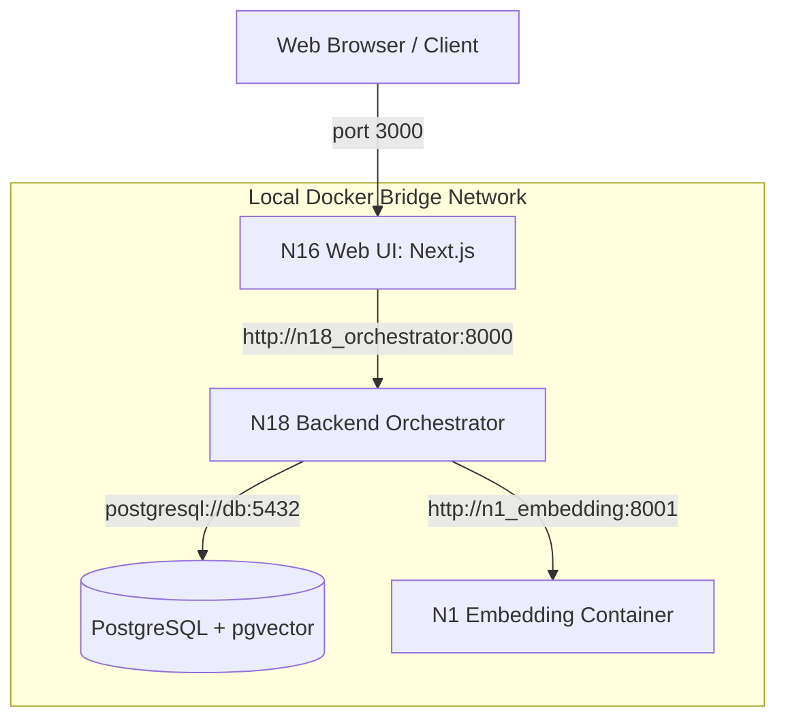

# Travel Experience Planner Reflourished

Travel planning system with semantic retrieval, multimodal inputs, and dynamic LLM generation.

This is a solo capstone project extending a legacy group-project monolith. Application code is frozen at Phase 0. Subsequent phases focus on containerization, orchestration, observability, and resilience.

## Core Features
- **Multi-modal Semantic Search:** Processes user preferences through text and images.
- **Dynamic Activity Generation:** Generates contextual itineraries via Groq LLMs based on real locations.
- **Feedback Loop:** Ingests user feedback to refine real-time recommendations.

## Technology Stack
- **Frontend:** Next.js
- **Backend Orchestrator:** FastAPI (N18)
- **LLM Engine:** Groq (Llama3/Mixtral)
- **Embeddings:** SentenceTransformers (`intfloat/multilingual-e5-small` & `BAAI/bge-m3`)
- **Database:** PostgreSQL with `pgvector`

## Quick Start (Docker Compose - Phase 1)
Requires Docker Desktop installed and running.

1. **Configure Environment:**
   ```bash
   cp .env.example .env
   # Edit .env and populate: GROQ_API_KEY, INTERNAL_API_KEY
   ```
2. **Start the Stack:**
   ```bash
   docker compose up -d
   ```
3. **Database Initialization & Seeding:**
   *(Run this once after the initial startup)*
   ```bash
   venv/Scripts/python backend/n3_database/seeds/seed_with_vectors.py --reset-all
   ```

### Service Endpoints
| Service | URL (Host Machine) | URL (Internal Container Network) |
|---|---|---|
| Frontend (Next.js - N16) | http://127.0.0.1:3000 | http://n16_web_ui:3000 |
| Orchestrator Backend (N18) | http://127.0.0.1:8000 | http://n18_orchestrator:8000 |
| Embedding Service (N1) | http://127.0.0.1:8001 | http://n1_embedding:8001 |
| Local Database (Postgres - N3) | http://127.0.0.1:5432 | http://db:5432 |

---

## Container Network Architecture (Phase 1)



---

## Data Pipeline
- **Vector Generation:** `python backend/n3_database/seeds/embed_locations.py` generates embeddings for locations in `locations.json`, outputting to `locations_with_vectors.json`.

## Architecture (Phase 0 Baseline)
The system uses a Hub-and-Spoke topology. Modules N1-N17 execute in-process within the N18 FastAPI orchestrator. Boundaries are enforced via Pydantic V2 contracts.

| Module | Function |
|---|---|
| N0 | Sample module template |
| N1 | Embedding generation (BGE-M3, E5) |
| N2 | Image processing to text |
| N3 | PostgreSQL persistence (locations, users, history) |
| N4 | Location ranking (cosine similarity) |
| N5 | Activity generation (LLM) |
| N6 | Activity ranking |
| N16 | Next.js Frontend |
| N17 | Feedback processing |
| N18 | FastAPI Orchestrator |
| N7–N15 | Deprecated — not implemented |

### Current Operational Risks
- **No isolation:** In-process execution model lacks container boundaries. Memory exhaustion in N1 crashes the N18 API.
- **Cloud dependency:** Database relies on a managed cloud instance (Supabase).
- **Synchronous blocking:** N5 calls Groq synchronously. A `429` blocks N18 worker threads, causing a system-wide cascading failure.

---

- [`docs/plans/roadmap.md`](docs/plans/roadmap.md) — full phase roadmap
- [`docs/plans/docs-tree.md`](docs/plans/docs-tree.md) — documentation index
- [`docs/adrs/`](docs/adrs/) — architecture decision records
- Continued iteration of the original `travel-exp-planner`. See LICENSE.