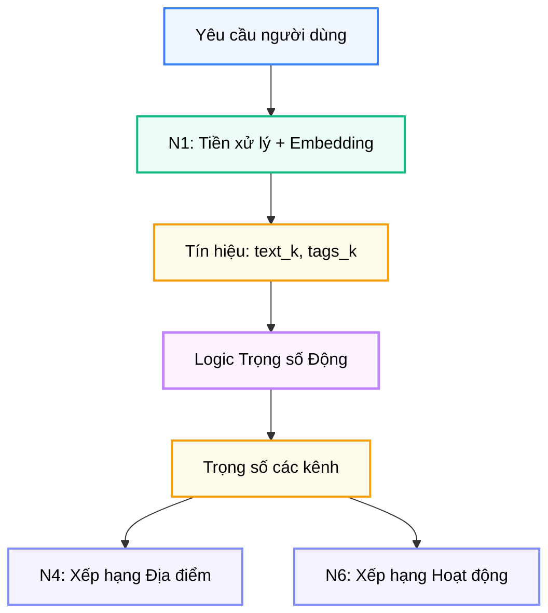

# Hệ thống Trọng số Động (Dynamic Weighting System)

**Dự án:** Travel Experience Planner  
**Ngày:** 2026-05-15

---

## 1. Vấn đề mà Dynamic Weighting giải quyết

Trong một hệ thống recommendation đa tín hiệu, khó khăn lớn nhất không nằm ở việc “có bao nhiêu vector”, mà nằm ở việc **tin tín hiệu nào nhiều hơn trong từng truy vấn cụ thể**.

Ví dụ:

- có người dùng viết text rất rõ nhưng hầu như không chọn tags
- có người chọn nhiều tags rất tốt nhưng text cực ngắn
- có người gần như chỉ truyền cảm hứng qua ảnh

Nếu hệ thống luôn dùng một bộ trọng số cố định, nó sẽ ngầm giả định rằng mọi kênh đầu vào luôn có chất lượng ngang nhau. Giả định đó sai trong thực tế.

Dynamic weighting ra đời để giải quyết đúng điểm này:  
**không coi mọi kênh semantic là đáng tin như nhau, mà điều chỉnh trọng số dựa trên độ phong phú thực tế của tín hiệu đầu vào**.

---

## 2. Vị trí của cơ chế này trong kiến trúc

Dynamic weighting không phải một module độc lập, mà là một lớp logic nằm giữa:

- đầu ra tiền xử lý của N1
- các bước xếp hạng ở N4 và N6

Ý nghĩa kiến trúc của nó rất rõ:

- N1 cung cấp **chất lượng tín hiệu**
- N4 và N6 sử dụng **trọng số đã điều tiết**

Như vậy, hệ thống không chỉ biết “vector nào gần vector nào”, mà còn biết **nên tin vector nào hơn**.

---

## 3. Bốn kênh semantic được điều phối

Hệ thống hiện sử dụng bốn kênh semantic chính:

| Kênh | Nguồn dữ liệu | Ý nghĩa |
|---|---|---|
| `text` | văn bản gốc | ý định trực tiếp, literal intent |
| `aug_text` | text sau augmentation | ngữ cảnh mở rộng, diễn giải ý định |
| `aug_tags` | tags sau expansion | tín hiệu sở thích có cấu trúc |
| `img_desc` | mô tả ảnh | tín hiệu thị giác chuyển sang ngữ nghĩa |

### 3.1. Vì sao phải điều phối từng kênh riêng?

Vì mỗi kênh có điểm mạnh và điểm yếu khác nhau:

- `text` mạnh khi người dùng viết rõ và chi tiết
- `aug_text` mạnh khi text ngắn nhưng augmentation tìm được nhiều context
- `aug_tags` mạnh khi user dùng bộ tags tốt, có cấu trúc
- `img_desc` mạnh như tín hiệu bổ trợ, đặc biệt khi text mơ hồ

Nếu gộp tất cả thành một điểm cố định hoặc một vector hợp nhất không kiểm soát, hệ thống sẽ mất đi khả năng thích nghi theo tình huống.

---

## 4. Hai tín hiệu điều khiển: `text_k` và `tags_k`

Dynamic weighting hiện dựa trên hai chỉ số xuất ra từ N1:

- `text_k`
- `tags_k`

### 4.1. `text_k` phản ánh điều gì?

`text_k` đo mức độ mà text đầu vào thực sự chứa các tín hiệu có thể khai thác để augmentation:

- cảm xúc
- ngữ cảnh
- tình huống sử dụng

Nói đơn giản, `text_k` càng cao thì:

- text càng “có nội dung”
- phần `text` và `aug_text` càng đáng tin

### 4.2. `tags_k` phản ánh điều gì?

`tags_k` đo số lượng tag hợp lệ được nhận diện và mở rộng thành công.

`tags_k` càng cao thì:

- bộ tags càng có giá trị semantic
- kênh `aug_tags` càng nên được ưu tiên

### 4.3. Tại sao không dùng độ dài text hay số lượng tag thô?

Vì độ dài bề ngoài không phản ánh chất lượng thực:

- một câu dài có thể rất nhiễu
- nhiều tags có thể trùng ý hoặc ít giá trị

Ngược lại, `text_k` và `tags_k` phản ánh **tín hiệu hữu ích sau tiền xử lý**, nên phù hợp hơn nhiều để làm đầu vào cho weighting.

---

## 5. Cơ chế tier hóa tín hiệu

Hệ thống không dùng `text_k` và `tags_k` trực tiếp như số thực liên tục, mà chuyển chúng thành các **tiers**.

### 5.1. Text tiers

- **Tier 0:** gần như không có tín hiệu text hữu ích
- **Tier 1:** text còn nghèo, cần augmentation bù mạnh
- **Tier 2:** text ở mức trung bình, có thể bắt đầu cân bằng giữa `text` và `aug_text`
- **Tier 3:** text giàu tín hiệu, nên ưu tiên ý định gốc hơn augmentation

### 5.2. Tag tiers

- **Tier 0:** không có tags đáng tin
- **Tier 1:** tags có nhưng còn mỏng
- **Tier 2:** tags khá đầy đủ
- **Tier 3:** tags rất mạnh, có thể dùng như semantic anchor chính

### 5.3. Vì sao tier hóa thay vì dùng hàm liên tục?

Tier hóa có ba lợi ích:

1. dễ giải thích trong báo cáo
2. dễ tinh chỉnh bằng tay
3. ổn định hơn khi số lượng tín hiệu dao động nhỏ

Với một đồ án hoặc hệ thống học thuật, đây là lựa chọn rất hợp lý vì ưu tiên tính minh bạch và khả năng kiểm soát.

---

## 6. Ma trận trọng số hai chiều

Sau khi xác định text tier và tag tier, hệ thống dùng một ma trận 2D để suy ra trọng số cuối cùng cho bốn kênh.

**Ký hiệu thứ tự cột:** `text / aug_text / aug_tags / img_desc`

| Text \ Tag | Tier 0 | Tier 1 | Tier 2 | Tier 3 |
|---|---|---|---|---|
| **Tier 0** | `1.00 / 0.00 / 0.00 / 0.20` | `0.40 / 0.00 / 0.60 / 0.20` | `0.30 / 0.00 / 0.70 / 0.20` | `0.25 / 0.00 / 0.75 / 0.20` |
| **Tier 1** | `0.20 / 0.80 / 0.00 / 0.20` | `0.10 / 0.60 / 0.30 / 0.20` | `0.10 / 0.50 / 0.40 / 0.20` | `0.10 / 0.40 / 0.50 / 0.20` |
| **Tier 2** | `0.70 / 0.30 / 0.00 / 0.20` | `0.50 / 0.20 / 0.30 / 0.20` | `0.45 / 0.15 / 0.40 / 0.20` | `0.40 / 0.15 / 0.45 / 0.20` |
| **Tier 3** | `0.90 / 0.10 / 0.00 / 0.20` | `0.65 / 0.05 / 0.30 / 0.20` | `0.60 / 0.05 / 0.35 / 0.20` | `0.55 / 0.05 / 0.40 / 0.20` |

### 6.1. Cách đọc ma trận này

Ví dụ:

- nếu text rất yếu nhưng tags mạnh, trọng số sẽ nghiêng sang `aug_tags`
- nếu text rất mạnh còn tags yếu, trọng số sẽ nghiêng sang `text`
- nếu text ở mức thấp nhưng vẫn có tín hiệu, `aug_text` sẽ được nâng lên để làm “bộ bù ngữ nghĩa”

### 6.2. Vì sao `img_desc` thường giữ mức ổn định?

Kênh ảnh hiện đóng vai trò bổ trợ hơn là thống trị. Giữ một mức trọng số tương đối ổn định cho `img_desc` giúp:

- tận dụng tín hiệu thị giác khi có
- tránh để ảnh lấn át toàn bộ truy vấn text/tags

Đây là một quyết định rất thực dụng, nhất là khi không phải mọi truy vấn đều có ảnh.

---

## 7. Phân tích hành vi của từng vùng ma trận

### 7.1. Vùng text yếu, tags yếu

Khi cả hai cùng yếu, hệ thống rơi vào tình huống thiếu thông tin. Trong trường hợp này:

- không thể tin mạnh vào `aug_tags`
- augmentation text cũng không có nhiều thứ để bù

Do đó, hệ thống giữ score ở trạng thái khá trung tính và dựa nhiều hơn vào phần semantic trực tiếp còn lại.

### 7.2. Vùng text yếu, tags mạnh

Đây là tình huống lý tưởng cho `aug_tags`. Người dùng có thể không diễn đạt dài dòng, nhưng đã cung cấp bộ tags rõ nghĩa. Khi đó:

- `aug_tags` trở thành điểm tựa chính
- `text` và `aug_text` chỉ đóng vai trò phụ

### 7.3. Vùng text mạnh, tags yếu

Khi text mô tả rất rõ nhưng tags ít hoặc yếu, hệ thống phải tránh việc “ép nghĩa” theo tags. Khi đó:

- `text` nên trở thành kênh chủ đạo
- `aug_text` vẫn hỗ trợ nhẹ
- `aug_tags` gần như bị vô hiệu hóa

### 7.4. Vùng cả text và tags đều mạnh

Đây là vùng giàu tín hiệu nhất. Mục tiêu không phải chọn một kênh thắng tuyệt đối, mà là:

- giữ `text` làm trục chính
- vẫn tận dụng `aug_tags` như semantic anchor
- giảm vai trò `aug_text` vì augmentation lúc này có nguy cơ thêm nhiễu hơn là thêm giá trị

---

## 8. Ý nghĩa học thuật và kỹ thuật của cơ chế này

Dynamic weighting là một lớp logic nhỏ nhưng rất có ý nghĩa vì nó giải quyết được một vấn đề phổ quát trong hệ thống AI đa nguồn: **đầu vào luôn không đồng đều về chất lượng**.

Về mặt học thuật, nó thể hiện rõ một số tư duy thiết kế:

- không coi mọi feature là quan trọng ngang nhau
- tách bước “đánh giá độ tin cậy tín hiệu” khỏi bước “tính similarity”
- ưu tiên khả năng giải thích thay vì chỉ tối ưu một hàm điểm khó đọc

Về mặt kỹ thuật, nó giúp:

- ranking ổn định hơn
- score spread tốt hơn
- kết quả dễ giải thích hơn cho người dùng và người chấm báo cáo

---

## 9. Kết luận

Dynamic weighting là lớp “điều tiết thông minh” của hệ thống semantic recommendation. Thay vì để mọi kênh semantic phát biểu ngang nhau, cơ chế này cho phép hệ thống:

- lắng nghe mạnh hơn ở kênh nào đáng tin hơn
- bù tín hiệu khi truy vấn còn nghèo
- giảm nhiễu khi truy vấn đã đủ rõ

Đây là một thành phần nhỏ về mặt code nhưng có giá trị rất lớn về mặt kiến trúc và chất lượng kết quả.
