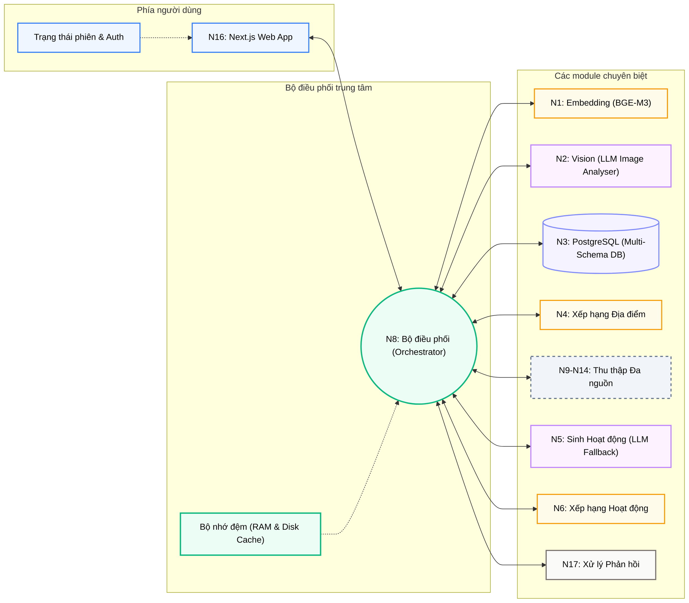
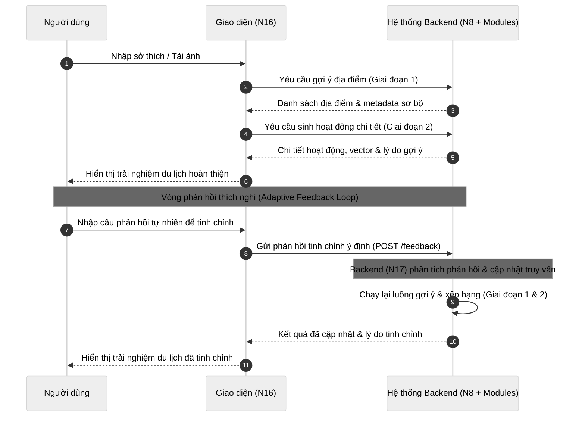

# Tổng quan Kiến trúc Hệ thống

**Dự án:** Travel Experience Planner  
**Phiên bản:** 1.0 (Modular Architecture)  
**Ngày:** 2026-05-15

---

## 1. Bài toán mà hệ thống giải quyết

Travel Experience Planner được thiết kế để giải quyết một bài toán recommendation có tính đa chiều: người dùng không chỉ muốn biết “đi đâu”, mà còn muốn hệ thống hiểu được:

- phong cách du lịch
- cảm xúc mong muốn
- dạng trải nghiệm phù hợp
- hoạt động nên làm tại điểm đến

Khó khăn của bài toán này là đầu vào rất không đồng đều:

- có người viết text chi tiết
- có người chỉ chọn tags
- có người gửi hình ảnh làm cảm hứng

Do đó, kiến trúc hệ thống buộc phải vừa linh hoạt ở đầu vào, vừa đủ chặt chẽ ở các tầng semantic và ranking phía sau.

---

## 2. Triết lý thiết kế kiến trúc

Hệ thống được xây theo hướng **module hóa theo chức năng chuyên biệt**, trong đó mỗi module đảm nhận một vai trò hẹp nhưng rõ ràng:

- hiểu input
- chuyển đổi thành vector
- lưu trữ dữ liệu
- xếp hạng địa điểm
- sinh hoạt động
- xếp hạng hoạt động
- hiển thị và điều phối vòng phản hồi

### 2.1. Vì sao module hóa?

Module hóa đem lại ba lợi ích lớn:

1. **Dễ thay thế thành phần:** có thể đổi model hoặc logic từng phần mà không phá vỡ toàn hệ thống.
2. **Dễ kiểm thử và benchmark:** từng module có thể được đánh giá độc lập.
3. **Dễ viết báo cáo kỹ thuật:** mỗi tầng có thể được giải thích theo trách nhiệm riêng.

### 2.2. Vai trò trung tâm của lớp điều phối

Tuy hệ thống module hóa, dữ liệu không được phép đi tự do giữa mọi thành phần. Thay vào đó, N8 giữ vai trò trung tâm điều phối để:

- ghép đúng thứ tự pipeline
- kiểm soát request/response
- gom các concern vận hành như cache, bảo mật, feedback

Đây là một kiến trúc dạng **hub-and-spoke** ở mức ứng dụng.

---

## 3. Sơ đồ tổng thể kiến trúc

### 3.1. Ý nghĩa của sơ đồ này

Sơ đồ cho thấy ba lớp lớn:

- **Frontend/UI**
- **Application orchestration**
- **Domain modules**

Điều này giúp hệ thống giữ được hai tầng tách biệt:

- tầng tương tác với người dùng
- tầng xử lý semantic nội bộ

---

## 4. Luồng dữ liệu Macro (High-level)

Hệ thống vận hành theo cơ chế hai giai đoạn (two-pass) để đảm bảo tốc độ phản hồi tối ưu cho người dùng.

Chi tiết luồng thực thi kỹ thuật bên trong Backend được mô tả cụ thể tại tài liệu của [Module N8: Orchestrator](../modules/n8_orchestrator.md).

### 4.3. Ý nghĩa của cách tổ chức này

Hệ thống không sinh hoạt động trước rồi mới xếp hạng địa điểm, mà tách thành hai tầng:

- lọc “đi đâu” trước
- sau đó mới tính “làm gì”

Đây là một thiết kế hợp lý vì:

- giảm không gian tìm kiếm hoạt động
- tránh lãng phí generation ở những địa điểm không đủ phù hợp
- giúp pipeline dễ giải thích hơn

---

## 5. Phân rã vai trò các module

### N1: Embedding

Biến text, tags, image description thành biểu diễn vector nhiều kênh. Đây là trái tim semantic của hệ thống và là nơi tạo nền cho augmentation và dynamic weighting.

### N2: Vision

Biến tín hiệu hình ảnh thành mô tả văn bản ngắn nhưng giàu ngữ nghĩa, nhằm đưa hình ảnh vào cùng pipeline semantic với text.

### N3: Database

Lưu trữ record địa điểm như một gói dữ liệu đầy đủ gồm vector, metadata, geo và ảnh nhị phân. Đây là single source of truth của dữ liệu địa điểm.

### N4: Location Ranking

So khớp semantic giữa user vectors và location vectors, sau đó áp dụng trọng số động để chọn ra danh sách địa điểm phù hợp nhất.

### N5: Activity Generation

Sinh hoạt động ứng viên cho từng địa điểm bằng chiến lược LLM-first, template-backup.

### N6: Activity Ranking

Xếp hạng hoạt động dựa trên hybrid scoring: semantic fit + attribute fit.

### N16: Frontend UI

Thu thập input đa phương thức, hiển thị kết quả, lưu session state và hỗ trợ feedback loop.

### N8: Orchestrator

Điều phối toàn bộ workflow, quản lý cache, route protection và response enrichment.

### N17: Feedback Processing

Tinh chỉnh lại trạng thái truy vấn hiện tại từ feedback mới của người dùng, giúp hệ thống chạy lại recommendation theo hướng tự nhiên hơn.

---

## 6. Hai ý tưởng kiến trúc cốt lõi của hệ thống

### 6.1. Multi-channel semantics

Thay vì ép mọi tín hiệu vào một vector duy nhất, hệ thống giữ nhiều kênh semantic:

- `text`
- `aug_text`
- `aug_tags`
- `img_desc`

Điều này giúp:

- bảo toàn nguồn gốc tín hiệu
- tăng khả năng giải thích
- mở đường cho dynamic weighting

### 6.2. Progressive refinement

Hệ thống không xem recommendation là tác vụ “một lần là xong”. Việc có N17 và feedback endpoints cho thấy kiến trúc này hướng đến:

- lặp lại truy vấn có kiểm soát
- sửa dần đầu vào theo phản hồi người dùng
- tiến gần mô hình assistant hơn là search engine truyền thống

---

## 7. Các cơ chế tối ưu hiệu năng

Kiến trúc hiện tại dùng ba lớp tối ưu hiệu năng đáng chú ý:

### 7.1. Batch embedding

N1 dùng batch processing để giảm số lần gọi model nhúng.

### 7.2. Hybrid cache ở N8

N8 kết hợp:

- RAM cache
- disk cache
- image cache

để giảm số lần đọc dữ liệu đầy đủ từ tầng lưu trữ.

### 7.3. Fingerprint-based refresh

Thay vì reload thô toàn bộ dữ liệu địa điểm, hệ thống dùng fingerprint để quyết định khi nào cần làm mới cache.

Đây là một quyết định có giá trị cao vì vừa nhẹ chi phí, vừa giảm rủi ro stale data.

---

## 8. Ý nghĩa học thuật của kiến trúc

Điểm mạnh của kiến trúc này trong bối cảnh báo cáo kỹ thuật không chỉ là “nó chạy được”, mà còn là nó thể hiện rõ nhiều nguyên tắc hiện đại:

- tách concern theo module
- semantic retrieval nhiều kênh
- dynamic weighting thay vì scoring cứng
- generation có fallback
- feedback-driven refinement
- orchestration + cache ở tầng ứng dụng

Nhờ đó, báo cáo có thể không chỉ trình bày một ứng dụng AI, mà trình bày một **pipeline recommendation có cấu trúc rõ, có giải thích, và có khả năng mở rộng**.

---

## 9. Kết luận

Travel Experience Planner là một hệ thống recommendation theo hướng semantic, đa tín hiệu và có vòng phản hồi. Kiến trúc của nó được xây để cân bằng giữa:

- độ linh hoạt của input
- chất lượng của semantic matching
- tính ổn định của generation
- trải nghiệm sử dụng thực tế

Đây là một kiến trúc đủ gọn để triển khai trong phạm vi đồ án, nhưng cũng đủ rõ ràng và có chiều sâu để phân tích như một hệ thống AI hoàn chỉnh.
