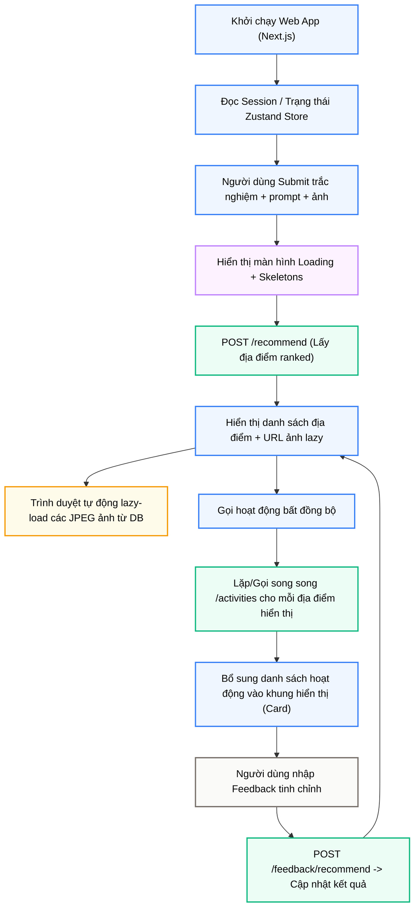

# Module N16: Giao diện Next.js Web App

**Dự án:** Travel Experience Planner  
**Ngày:** 2026-05-21

---

## 1. Vai trò của Module N16

N16 là lớp tiếp xúc trực tiếp với người dùng. Với việc nâng cấp hệ thống từ Streamlit (dạng script-rerun tuần tự) sang **Next.js Web App** (Client-Server bất đồng bộ), N16 mang lại khả năng tương tác vượt trội, phản hồi thời gian thực và trải nghiệm mượt mà xứng tầm một ứng dụng thương mại cao cấp.

Trong bài toán gợi ý du lịch, N16 Next.js giải quyết triệt để 3 bài toán lớn:
- **Tương tác bất đồng bộ (Non-blocking UI):** Khắc phục hoàn toàn hiện tượng lag/đơ giao diện khi chờ API AI phân tích hoặc tải hình ảnh nhị phân dung lượng lớn.
- **Trạng thái phiên linh hoạt (Dynamic Session Management):** Lưu trữ thông tin đăng nhập, token bảo mật, và lịch sử khuyến nghị của người dùng xuyên suốt các trang.
- **Đa dạng hóa không gian trải nghiệm:** Cung cấp đồng thời chế độ Khám phá bản đồ 3D (Explore Map) và chế độ Lập kế hoạch chi tiết (Planner Page).

---

## 2. Tư duy Kiến trúc và Stack Công nghệ

N16 được thiết kế theo mô hình Single Page Application (SPA) kết hợp Server-Side Rendering (SSR) tối ưu:

- **Khung ứng dụng:** **Next.js 15** (React 19) sử dụng **App Router** (`src/app`) để phân chia routes.
- **Quản lý trạng thái:** **Zustand** (`src/store/planner-store.ts`) quản lý state tập trung cho toàn bộ luồng nhập liệu, lịch sử và hiển thị kết quả.
- **Thiết kế giao diện:** **Tailwind CSS** kết hợp thư viện **shadcn/ui** mang lại giao diện tối giản, Dark Mode cao cấp và chuyển động vi mô (micro-animations) tinh tế.
- **Đồng bộ hóa dữ liệu (Data Fetching):** Sử dụng **React Query** (TanStack Query) cho các luồng tải waterfall phức tạp.

---

## 3. Bản đồ Tương tác 3D (Discovery Map)

Đây là một tính năng trọng tâm của N16, cho phép người dùng hình dung chuyến đi theo không gian địa lý:

- Bản đồ 3D tương tác với tọa độ địa điểm.
- **Cụm hoạt động lan tỏa hình tròn (Radial Clustering):** Các điểm hoạt động được rải xung quanh anchor location với bán kính 350m để tránh đè marker lên nhau, giúp UI gọn gàng.
- **Tuân thủ quy chuẩn:** Tích hợp lớp phủ bản đồ hiển thị rõ ràng và tuân thủ tuyệt đối chủ quyền **Hoàng Sa & Trường Sa** của Việt Nam.

---

## 4. Trải nghiệm Nhập liệu (Wizard Slider)

N16 thu thập đầu vào đa phương thức thông qua ba kênh kết hợp trong một Wizard:

1. **Trắc nghiệm sở thích (Structured Preferences):** Chọn ngân sách, cường độ, phong cách qua UI card đẹp mắt.
2. **Mô tả tự nhiên (Free-text):** NLP box để người dùng giải thích ý định sâu hơn.
3. **Tải ảnh cảm hứng (Visual Upload):** Người dùng có thể upload ảnh (N2 sẽ tự động phân tích ở backend).

---

## 5. Các Kỹ thuật Tối ưu Hóa (Performance & UX)

### 5.1. Tải ảnh Lazy Loading cực hạn
Hệ thống loại bỏ hoàn toàn ảnh Base64 từ payload chính `/recommend`.
Frontend nhận JSON siêu nhẹ, render cấu trúc thẻ ngay lập tức. Sau đó, trình duyệt tự động gọi API dạng `/api/images/{id}_{idx}.jpg` để tải độc lập từng JPEG khi thẻ cuộn vào màn hình.

### 5.2. Tải tuần tự Waterfall (Sequential Rendering)
Với hoạt động chi tiết (activities), Next.js không block màn hình chờ toàn bộ kết quả.
N16 cấu hình React Query dependent chain để gọi `/activities` tuần tự từ kết quả Top 1 đến Top 5. Điều này giúp địa điểm số 1 hiển thị chi tiết ngay, tránh nghẽn luồng xử lý N8 Backend, và giữ cho UI mượt mà.

### 5.3. Phân tách Cache theo Sở thích
Giao diện sinh ra mã hóa `preferenceSignature` từ các filter (ngân sách, style...). Mã này được đưa vào `queryKey` của React Query, đảm bảo mỗi khi đổi filter, UI tự động gọi API cập nhật hoạt động mới phù hợp nhất thay vì hiển thị dữ liệu stale.

### 5.4. Việt hóa nhãn tối giản
Các label kỹ thuật (`Canyoning`, `Fine dining`) được format và cắt ngắn tự động tối đa **3 từ** ("Vượt thác", "Fine Dining") để UI Cards không bị vỡ bố cục trên Mobile.

---

## 6. Vòng phản hồi hai cấp (Interactive Feedback Loop)

Web App hiển thị hai luồng N17 Feedback:
- **Phản hồi toàn cục (Global Feedback):** Khung chat chính. Khi gửi "Tôi muốn chỗ nào yên tĩnh", nó gọi N17 cập nhật list địa điểm.
- **Phản hồi cục bộ (Local Activity Feedback):** Trong Drawer của từng địa điểm. Yêu cầu "Thêm chỗ ăn ngon" chỉ tinh chỉnh hoạt động của riêng địa điểm đó.

---

## 7. Khôi phục Phiên Người dùng (JSONB Restore)

Trang cá nhân `/profile` lưu trữ toàn bộ lịch sử (Input/Output). Dữ liệu này được N3 lưu dưới dạng `JSONB`. 
Điểm mạnh kỹ thuật: Người dùng bấm **"Tải phiên"**, N16 đẩy trọn vẹn JSON đó ngược vào Zustand store. Trạng thái cũ được khôi phục 100% không tốn một token LLM nào.

---

## 8. Kết luận

N16 Next.js đã chuyển đổi dự án từ một bản thử nghiệm dòng lệnh sang một sản phẩm Web ứng dụng thực thụ. Thiết kế bất đồng bộ, tải tuần tự waterfall, lazy load, Zustand store và bản đồ 3D tương tác là minh chứng cho một lớp UI/UX được hoàn thiện tỉ mỉ và đồng bộ sâu với khả năng xử lý AI của backend.

---

## 9. Tài liệu tham khảo

| # | Chủ đề | Nguồn tham khảo |
|---|---|---|
| 1 | Next.js 15 App Router | [nextjs.org/docs](https://nextjs.org/docs) |
| 2 | Zustand State Management | [github.com/pmndrs/zustand](https://github.com/pmndrs/zustand) |
| 3 | React Query (TanStack) | [tanstack.com/query/latest](https://tanstack.com/query/latest) |
