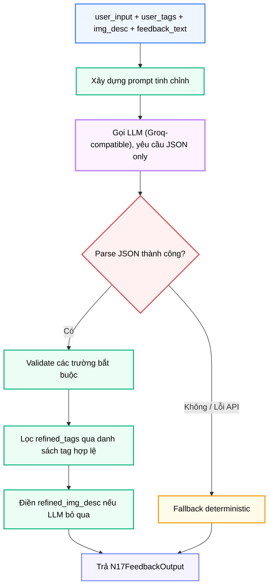
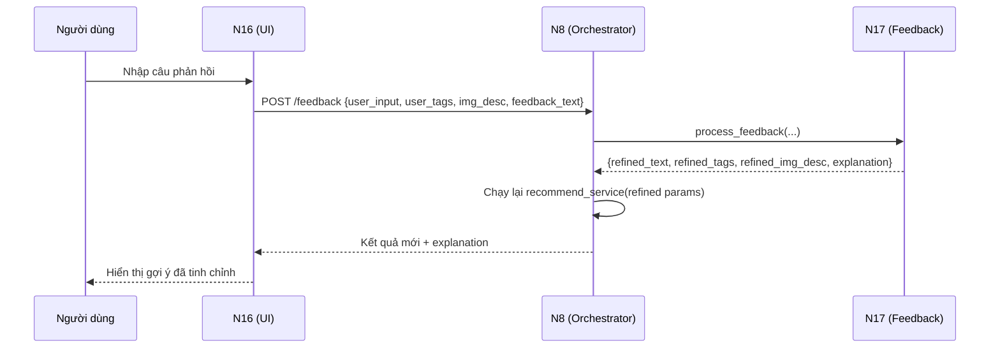

# Module N17: Xử lý Phản hồi và Tinh chỉnh Truy vấn

**Dự án:** Travel Experience Planner  
**Ngày:** 2026-05-21

---

## 1. Vai trò của Module N17

N17 là module cho phép hệ thống học từ phản hồi tức thời của người dùng trong cùng một phiên làm việc. Khi người dùng nhận được gợi ý và cảm thấy kết quả chưa đúng, thay vì phải nhập lại từ đầu, họ có thể nhắn một câu phản hồi tự nhiên như:

- "Tôi muốn thêm hoạt động ngoài trời"
- "Bớt ăn uống, thêm thiên nhiên"
- "Không thích địa điểm đông người"

N17 nhận câu đó, phân tích cùng với trạng thái truy vấn hiện tại, và tạo ra một bộ tham số mới (text, tags, img_desc) để N8 chạy lại toàn bộ pipeline recommendation.

---

## 2. Tư tưởng thiết kế: Query Refinement qua LLM

### 2.1. Vì sao cần module riêng thay vì sửa trực tiếp input?

Một cách tiếp cận đơn giản hơn là cho người dùng chỉnh sửa trực tiếp text và tag, rồi chạy lại pipeline. Tuy nhiên, cách đó:

- đòi hỏi người dùng biết cách dùng hệ thống
- không tận dụng được ngữ cảnh truy vấn hiện tại
- mất đi cơ hội phân tích ý định đằng sau câu phản hồi tự nhiên

N17 giải quyết việc này bằng cách xử lý ngôn ngữ tự nhiên để **tự động điều chỉnh tham số truy vấn** — người dùng nói chuyện tự nhiên, hệ thống lo phần kỹ thuật.

### 2.2. Vì sao cần fallback deterministic?

LLM có thể:

- trả về JSON không hợp lệ
- timeout hoặc bị rate limit
- bỏ qua các trường bắt buộc trong output

Nếu không có fallback, toàn bộ feedback loop sẽ sập khi gặp bất kỳ lỗi API nào. N17 đảm bảo hệ thống luôn trả về một payload hợp lệ để N8 có thể chạy lại.

---

## 3. Cấu trúc module

```
backend/modules/n17_feedback_processing/
├── __init__.py              # Re-export process_feedback
├── feedback_processor.py    # Xây dựng prompt, gọi LLM, parse, validate, fallback
└── requirements.txt
```

---

## 4. API công khai

```python
from modules.n17_feedback_processing import process_feedback
from backend.shared.contracts.n17_contracts import N17FeedbackInput

process_feedback(data: Union[N17FeedbackInput, dict]) -> dict
```

Áp dụng xác thực **Pydantic V2** tại biên module.

---

## 5. Contract đầu vào và đầu ra

### 5.1. Đầu vào

```python
class N17FeedbackInput(BaseModel):
    user_input: Optional[str] = ""     # Văn bản truy vấn hiện tại
    user_tags: List[str] = []          # Danh sách tag hiện tại
    img_desc: Optional[str] = ""       # Mô tả hình ảnh hiện tại
    feedback_text: Optional[str] = ""  # Câu phản hồi tự nhiên của người dùng
    llm_chain: Optional[str] = None    # Override chuỗi model (tùy chọn)
```

N17 cần **cả trạng thái hiện tại lẫn câu phản hồi mới** để có thể tạo ra phiên bản cải thiện, chứ không chỉ xử lý câu phản hồi trong chân không.

### 5.2. Đầu ra

```python
class N17FeedbackOutput(BaseModel):
    refined_text: Optional[str] = ""
    refined_tags: List[str] = []
    refined_img_desc: Optional[str] = ""
    explanation: Optional[str] = ""    # Hiển thị trên N16 UI
    metadata: Dict[str, Any] = {}      # Provider, model, token usage
```

| Trường | Vai trò |
|---|---|
| `refined_text` | Text truy vấn mới gửi vào N1 |
| `refined_tags` | Tag mới, đã lọc qua danh sách tag hợp lệ |
| `refined_img_desc` | Mô tả ảnh (thường giữ nguyên trừ khi feedback thay đổi focus) |
| `explanation` | Hiển thị cho người dùng thấy hệ thống đã điều chỉnh gì |

N8 dùng ba trường `refined_*` để chạy lại `recommend_service()` hoặc `activities_service()`.

---

## 6. Luồng xử lý



---

## 7. Cơ chế Fallback

Khi LLM thất bại hoặc trả về JSON không hợp lệ:

| Trường | Giá trị fallback |
|---|---|
| `refined_text` | Nối `user_input` + `feedback_text` |
| `refined_tags` | Giữ nguyên `user_tags` |
| `refined_img_desc` | Giữ nguyên `img_desc` |
| `explanation` | `"Fallback: feedback appended to original query"` |

Fallback này đảm bảo N8 **luôn nhận được payload hợp lệ** để chạy lại pipeline, không bao giờ để lỗi API của N17 làm sập feedback loop.

---

## 8. Lọc tag

Tag từ LLM được lọc qua `backend.shared.maps.tags.ALL_TAGS` — chỉ giữ lại các tag nằm trong danh sách hợp lệ của hệ thống. Điều này ngăn LLM "bịa" tag không tồn tại và làm nhiễu pipeline N1/N4/N6.

---

## 9. Vị trí trong vòng phản hồi



---

## 10. Ghi chú vận hành

- N17 dùng cùng Groq-compatible endpoint với N5
- Retries được thực hiện qua chuỗi model chain
- Prompt yêu cầu LLM trả về JSON only — không markdown, không giải thích ngoài lề
- Log ghi nhận các lần thử LLM, kết quả parse, và sự kiện fallback

---

## 11. Kết luận

N17 là module biến hệ thống từ một "công cụ tìm kiếm một lần" thành một "vòng lặp gợi ý thích ứng". Giá trị cốt lõi của nó không nằm ở độ phức tạp kỹ thuật, mà ở việc:

- hiểu ý định người dùng qua ngôn ngữ tự nhiên
- chuyển đổi ngôn ngữ tự nhiên thành tham số có cấu trúc
- đảm bảo pipeline không bao giờ bị gián đoạn dù LLM thất bại

Đây là một thiết kế thực tế và robustness-first, phù hợp với hệ thống cần hoạt động ổn định trong môi trường API rate-limited.

---

## 12. Tài liệu tham khảo

| # | Chủ đề | Nguồn tham khảo |
|---|---|---|
| 1 | Groq API | [console.groq.com/docs](https://console.groq.com/docs) |
| 2 | Tag system | [docs/architecture/tagging_system.md](../architecture/tagging_system.md) |
| 3 | N8 Feedback endpoint | [modules/n8_orchestrator.md](n8_orchestrator.md) |
