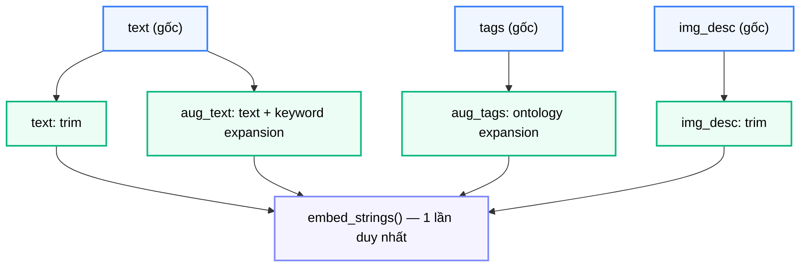

# Module N1: Nhúng Vector Đa Kênh

**Dự án:** Travel Experience Planner  
**Ngày:** 2026-05-21

---

## 1. Vai trò của Module N1

N1 là điểm vào ngữ nghĩa của toàn bộ hệ thống. Trước khi bất kỳ địa điểm hay hoạt động nào có thể được xếp hạng, hệ thống cần chuyển đổi tín hiệu thô của người dùng — văn bản tự do, tag lựa chọn, mô tả hình ảnh — thành các biểu diễn vector số học mà máy tính có thể so sánh được.

Không một module nào trong hệ thống có thể thực hiện semantic matching nếu thiếu output của N1. Đây là nền tảng của toàn bộ khả năng hiểu ngữ nghĩa.

Điểm đặc biệt là N1 không chỉ nhúng một kênh duy nhất mà duy trì **bốn kênh vector song song**, mỗi kênh phản ánh một khía cạnh ngữ nghĩa khác nhau của cùng một đầu vào.

---

## 2. Tư tưởng thiết kế: Multi-channel Embedding

### 2.1. Vì sao không nhúng một vector duy nhất?

Nếu gộp tất cả tín hiệu vào một vector duy nhất:

- text và tags sẽ "pha loãng" nhau
- hình ảnh nếu có sẽ bị hòa tan vào phần còn lại
- không còn khả năng điều chỉnh trọng số theo từng tín hiệu

Người dùng chỉ nhập text chi tiết nhưng không chọn tag sẽ bị xử lý giống hệt người chỉ chọn tag nhưng không viết gì. Đây là điều không mong muốn.

### 2.2. Lý do chọn bốn kênh

N1 giữ bốn kênh riêng biệt:

| Kênh | Nội dung |
|---|---|
| `text` | Văn bản gốc, trim |
| `aug_text` | Văn bản gốc + mở rộng từ khóa cảm xúc/ngữ cảnh |
| `aug_tags` | Mở rộng ontology từ các giá trị tag hợp lệ |
| `img_desc` | Mô tả hình ảnh ngắn từ N2 |

Mỗi kênh được nhúng độc lập. Điều này cho phép các module ranking sau (N4, N6) **lựa chọn và điều chỉnh trọng số** từng kênh dựa trên chất lượng tín hiệu thực tế của truy vấn.

### 2.3. Ý nghĩa của text_k và tags_k

Cùng với vector, N1 trả về hai bộ đếm:

- `text_k`: số lần mở rộng ngữ cảnh/cảm xúc được thêm vào `aug_text`
- `tags_k`: số lần mở rộng ontology tag hợp lệ

Hai con số này là tín hiệu về **mức độ phong phú** của tín hiệu đầu vào. N4 và N6 dùng chúng để giải quyết trọng số kênh động — khi `tags_k` cao, có nghĩa là người dùng đã chọn nhiều tag có nghĩa, hệ thống nên tin tưởng kênh `aug_tags` hơn.

---

## 3. Cấu trúc module

```
backend/modules/n1_embedding/
├── __init__.py      # API công khai: embed() và embed_batch()
├── embedder.py      # SentenceTransformer wrapper, model singleton, embed_strings()
├── preprocessor.py  # Mở rộng text, tra cứu ontology tag, xây dựng chuỗi kênh
└── requirements.txt
```

---

## 4. API công khai

```python
from modules.n1_embedding import embed, embed_batch

embed(data: Union[N1EmbedInput, dict]) -> dict
embed_batch(data_list: list[Union[N1EmbedInput, dict]]) -> list[dict]
```

`embed()` là wrapper mỏng của `embed_batch([data])`. Cả hai hàm đều xác thực input bằng **Pydantic V2** tại biên module.

---

## 5. Contract đầu vào và đầu ra

### 5.1. Đầu vào

```python
class N1EmbedInput(BaseModel):
    text: str = ""       # Văn bản tự do của người dùng
    tags: List[str] = [] # Danh sách tag du lịch có kiểm soát
    img_desc: str = ""   # Mô tả hình ảnh từ N2 (tùy chọn)
```

Tất cả trường đều tùy chọn. Cần ít nhất một trường không rỗng để tạo ra vector có ích.

### 5.2. Đầu ra

```python
class N1EmbedOutput(BaseModel):
    text_k: int                    # Số lần mở rộng aug_text
    tags_k: int                    # Số lần mở rộng ontology tag
    preprocessed: PreprocessedText # Chuỗi thực tế gửi cho model
    vectors: EmbedVectors          # Bốn kênh vector 1024 chiều
    metadata: Dict[str, Any]       # {model, device, latency_ms}
```

Vector `None` được tạo ra khi kênh tương ứng không có nội dung — cấu trúc được bảo toàn nhưng không thực hiện embedding.

---

## 6. Luồng tiền xử lý

Trước khi gọi model, `preprocessor.preprocess()` xây dựng bốn chuỗi kênh:



Các bước mở rộng:

- `aug_text`: text gốc cộng thêm các từ khóa cảm xúc và ngữ cảnh được tìm thấy trong từ điển mở rộng
- `aug_tags`: mỗi tag hợp lệ được tra trong ontology và mở rộng thành một chuỗi giàu nghĩa hơn

---

## 7. Chiến lược batch embedding

`embed_batch()` là đường xử lý thông lượng cao, được N8 dùng cho cả hai tình huống: nhúng truy vấn người dùng và nhúng hàng loạt hoạt động.

```mermaid
%%{init: {'flowchart': {'useMaxWidth': false}}}%%
graph LR
    classDef in fill:#eff6ff,stroke:#3b82f6,stroke-width:2px,color:#000000;
    classDef op fill:#ecfdf5,stroke:#10b981,stroke-width:2px,color:#000000;
    classDef model fill:#fdf2ff,stroke:#c084fc,stroke-width:2.5px,color:#000000;
    classDef out fill:#f5f3ff,stroke:#818cf8,stroke-width:2px,color:#000000;

    A["N item đầu vào"]:::in --> B["Tiền xử lý: N × 4 chuỗi"]:::op
    B --> C["Flatten → danh sách 4N chuỗi"]:::op
    C --> D["BGE-M3 encode() — 1 lần duy nhất"]:::model
    D --> E["Unflatten → N dict kết quả"]:::op
    E --> F["Output list[dict]"]:::out
```



Điểm mấu chốt: chỉ **một lần forward pass** qua model cho toàn bộ batch, bất kể số item. Điều này giúp tối ưu throughput đáng kể so với gọi lặp lại cho từng item.

### 7.1. Vì sao thiết kế batch quan trọng?

Trong pipeline activities v2, N8 cần nhúng đồng thời nhiều chục hoạt động trước khi xếp hạng. Nếu mỗi hoạt động được nhúng riêng, chi phí sẽ tăng tuyến tính với số lượng. Với batch, chi phí inference gần như không đổi nhờ xử lý song song trên GPU/CPU.

---

## 8. Ghi chú vận hành

- Model: `BAAI/bge-m3` theo `config.EMBEDDING_MODEL_NAME`
- `normalize_embeddings=True` — vector đơn vị, sẵn sàng cho cosine similarity
- Chuỗi rỗng tạo ra vector `None`, bảo toàn cấu trúc trong output
- Model được load một lần dưới dạng module-level singleton qua `embedder.get_model()`
- Device (CPU/GPU) được tự động phát hiện và ghi nhận trong metadata

---

## 9. Kết luận

N1 là module cơ sở hạ tầng ngữ nghĩa của toàn bộ hệ thống. Giá trị của nó không chỉ là "tạo vector", mà còn là:

- duy trì bốn kênh semantic tách biệt để giữ nguồn gốc tín hiệu
- cung cấp tín hiệu đếm `text_k`/`tags_k` để hệ thống ranking có thể điều chỉnh trọng số thích ứng
- tối ưu throughput qua batch embedding với một lần forward pass duy nhất

Không có N1, toàn bộ hệ thống chỉ là xử lý ký tự, không phải semantic intelligence.

---

## 10. Tài liệu tham khảo

| # | Chủ đề | Nguồn tham khảo |
|---|---|---|
| 1 | BAAI/bge-m3 | [huggingface.co/BAAI/bge-m3](https://huggingface.co/BAAI/bge-m3) |
| 2 | SentenceTransformers | [sbert.net](https://www.sbert.net/) |
| 3 | Dynamic weighting | [docs/architecture/dynamic_weighting.md](../architecture/dynamic_weighting.md) |
| 4 | Pydantic V2 | [docs.pydantic.dev](https://docs.pydantic.dev/) |
