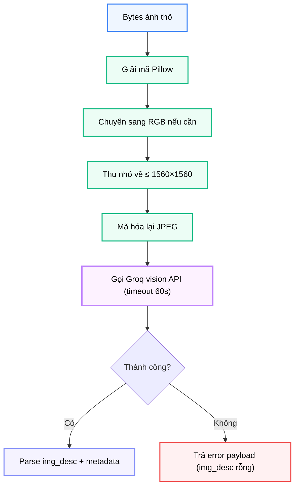

# Module N2: Xử lý Hình ảnh

**Dự án:** Travel Experience Planner  
**Ngày:** 2026-05-21

---

## 1. Vai trò của Module N2

N2 là cầu nối từ tín hiệu hình ảnh sang không gian văn bản trong pipeline ngữ nghĩa. Hệ thống hỗ trợ ba kênh đầu vào: văn bản tự do, tag lựa chọn, và hình ảnh cảm hứng. Hai kênh đầu có thể đi thẳng vào pipeline nhúng vector — nhưng hình ảnh thì không.

Hình ảnh cần được "dịch" sang ngôn ngữ mà N1 có thể xử lý. Đây chính là nhiệm vụ của N2.

Kết quả của N2 — một đoạn mô tả `img_desc` ngắn bằng tiếng Việt — được N1 nhúng vào kênh `img_desc` riêng biệt, cho phép ảnh tham gia vào quá trình semantic matching cùng với text và tag.

---

## 2. Tư tưởng thiết kế: Vision-to-Text Bridge

### 2.1. Vì sao không nhúng ảnh trực tiếp?

Một cách tiếp cận thay thế là dùng một model vision-language (VLM) có khả năng tạo embedding trực tiếp từ ảnh, bỏ qua bước chuyển đổi sang text. Tuy nhiên, hướng đó có những nhược điểm:

- các model VLM embedding (như CLIP) không cùng không gian vector với BGE-M3 — không thể so sánh trực tiếp
- cần hạ tầng inference riêng, tốn tài nguyên hơn
- kết quả khó giải thích và debug hơn

### 2.2. Lý do chọn vision → text → embed

Khi đưa ảnh qua bước mô tả văn bản trước:

- `img_desc` rơi vào cùng không gian ngôn ngữ với `text` và `aug_tags`
- có thể so sánh vector `img_desc` với vector `text` của địa điểm một cách tự nhiên
- kết quả mô tả có thể được đọc và kiểm tra bởi con người
- không cần thêm model riêng cho embedding ảnh

### 2.3. Yêu cầu về nội dung mô tả

N2 không chỉ cần trả về bất kỳ mô tả nào về ảnh. Mô tả phải:

- tập trung vào **cảnh quan và bầu không khí du lịch** — không phải mọi vật thể trong ảnh
- tối đa 50 từ — đủ ngắn để nhúng hiệu quả, đủ dài để chứa ngữ nghĩa
- tránh khuôn mẫu chung chung ("Trong ảnh có...", "Tôi thấy...")
- bằng tiếng Việt — nhất quán với ngôn ngữ chính của hệ thống

Đây là một ví dụ của **prompt engineering có mục đích**, không phải chỉ gọi API.

---

## 3. Cấu trúc module

```
backend/modules/n2_image_processing/
├── __init__.py    # Re-export process_image
├── processor.py   # Resize, nén JPEG, gọi Groq vision API, parse kết quả
└── requirements.txt
```

---

## 4. API công khai

```python
from modules.n2_image_processing import process_image
from backend.shared.contracts.n2_contracts import N2ImageInput

process_image(data: Union[N2ImageInput, dict]) -> dict
```

Áp dụng xác thực **Pydantic V2** tại biên module.

---

## 5. Contract đầu vào và đầu ra

### 5.1. Đầu vào

```python
class N2ImageInput(BaseModel):
    image: Optional[bytes] = None  # Bytes ảnh nhị phân thô
```

Nếu `image` là `None`, N2 trả về `{"img_desc": "", "error": "No image provided"}` ngay lập tức mà không gọi API.

### 5.2. Đầu ra

```python
class N2ImageOutput(BaseModel):
    img_desc: Optional[str] = ""           # Mô tả cảnh quan tiếng Việt
    metadata: Optional[Dict[str, Any]] = None  # Tên model, token usage
    error: Optional[str] = None            # Chuỗi lỗi nếu xử lý thất bại
```

Phản hồi lỗi **không phá vỡ pipeline** — N8 xử lý `img_desc` rỗng một cách an toàn bằng cách bỏ qua kênh `img_desc` trong phần nhúng vector.

---

## 6. Luồng xử lý



Bước tối ưu hóa ảnh cục bộ (resize + nén JPEG) được thực hiện trước khi gọi API để:

- tránh lỗi payload quá lớn
- giảm latency mạng
- đảm bảo ảnh luôn ở định dạng model có thể xử lý

---

## 7. Vị trí trong pipeline tổng thể

N2 chỉ được gọi khi người dùng tải ảnh lên qua N16. N8 kiểm tra điều kiện này trước khi gọi N2:

```
N16 → N8 (nhận body có image base64)
       ↓ (nếu có ảnh và chưa có img_desc)
      N2 → trả về img_desc
       ↓
      N1 (nhúng bốn kênh, kể cả img_desc)
```

Nếu người dùng không tải ảnh, N2 hoàn toàn không được gọi và kênh `img_desc` của N1 sẽ là chuỗi rỗng.

---

## 8. Ghi chú vận hành

- Vision provider: Groq API (`config.GROQ_VISION_MODEL`, `config.GROQ_API_URL`)
- Timeout request: 60 giây
- Tối ưu hóa ảnh thực hiện cục bộ trước khi gọi API
- `metadata` có mặt ở cả phản hồi thành công lẫn hầu hết đường lỗi

---

## 9. Kết luận

N2 là một module nhỏ nhưng đóng vai trò quan trọng trong việc mở rộng hệ thống sang đầu vào đa phương thức. Thiết kế vision-to-text thay vì vision-embedding trực tiếp là một lựa chọn thực dụng: giữ nguyên tính nhất quán của không gian vector, dễ debug, và không đòi hỏi thêm hạ tầng inference riêng biệt.

---

## 10. Tài liệu tham khảo

| # | Chủ đề | Nguồn tham khảo |
|---|---|---|
| 1 | Groq Vision API | [console.groq.com/docs](https://console.groq.com/docs) |
| 2 | Pillow (PIL) | [pillow.readthedocs.io](https://pillow.readthedocs.io/) |
| 3 | Llama Vision Preview | [groq.com/blog/llama-3-2-vision](https://groq.com/blog/llama-3-2-vision) |
