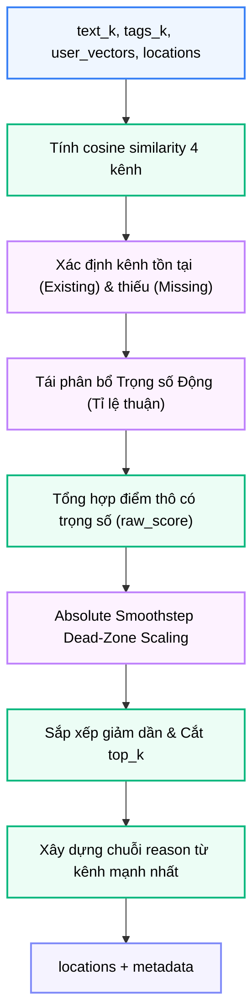

# Module N4: Xếp hạng Địa điểm

**Dự án:** Travel Experience Planner  
**Ngày:** 2026-05-21

---

## 1. Vai trò của Module N4

N4 là module ra quyết định "đi đâu". Sau khi N1 tạo ra các vector truy vấn từ input người dùng, và N3 cung cấp danh sách địa điểm ứng viên kèm vector, N4 thực hiện so khớp ngữ nghĩa và trả về danh sách địa điểm đã sắp xếp theo mức độ phù hợp.

Kết quả của N4 trực tiếp xác định địa điểm nào được hiển thị cho người dùng. Đây là module quyết định chất lượng cao nhất của pipeline recommendation.

---

## 2. Tư tưởng thiết kế: Multi-channel Cosine Matching với Dynamic Weighting

### 2.1. Vì sao không chỉ so khớp một vector?

Nếu chỉ dùng một vector `text` để so khớp, hệ thống bỏ qua:

- tín hiệu từ tag ontology (kênh `aug_tags`)
- tín hiệu từ văn bản đã mở rộng (kênh `aug_text`)
- tín hiệu từ hình ảnh người dùng tải lên (kênh `img_desc`)

Mỗi kênh thể hiện một khía cạnh ngữ nghĩa khác nhau. Gộp hết vào một kênh sẽ làm mất thông tin về **nguồn gốc tín hiệu**.

### 2.2. Vì sao trọng số kênh phải động, không cố định?

Nếu dùng trọng số cố định:

- người dùng chỉ chọn tag nhưng không viết text → kênh `aug_tags` rất mạnh, nhưng hệ thống vẫn chia đều trọng số → kết quả kém
- người dùng viết text chi tiết nhưng không chọn tag → `text_k` cao nhưng `tags_k` thấp → nên tin vào kênh text hơn

Bộ đếm `text_k` và `tags_k` từ N1 trở thành **tín hiệu điều chỉnh trọng số** — hệ thống tự điều chỉnh theo chất lượng thực tế của từng truy vấn.

### 2.3. Vì sao chuẩn hóa điểm theo top-1?

N4 chuẩn hóa điểm để kết quả tốt nhất luôn là `1.0` và các kết quả khác được tính tương đối. Điều này giúp:

- N8 có thể hiển thị điểm số có ý nghĩa cho người dùng
- tránh tình huống tất cả địa điểm đều có điểm thấp hoặc tất cả đều tương đương nhau

---

## 3. Cấu trúc module

```
backend/modules/n4_location_ranking/
├── __init__.py         # Re-export rank_locations
├── rank_locations.py   # Logic tính điểm, trọng số, chuẩn hóa
└── requirements.txt
```

---

## 4. API công khai

```python
from modules.n4_location_ranking import rank_locations
from backend.shared.contracts.n4_contracts import N4RankInput

rank_locations(data: Union[N4RankInput, dict]) -> dict
```

Áp dụng xác thực **Pydantic V2** tại biên module.

---

## 5. Contract đầu vào và đầu ra

### 5.1. Đầu vào

```python
class N4RankInput(BaseModel):
    text_k: int = 0
    tags_k: int = 0
    user_vectors: UserVectors          # Bốn kênh vector từ N1
    locations: List[Dict[str, Any]] = []  # Ứng viên địa điểm từ N3
    top_k: int = 5
```

> **Lưu ý ánh xạ:** N8 đổi key `vectors` của N3 thành `location_vectors` trước khi truyền sang N4 để khớp contract này.

### 5.2. Đầu ra

```python
class N4RankOutput(BaseModel):
    locations: List[RankedLocationItem]  # Danh sách đã sắp xếp
    metadata: Dict[str, Any]             # Timing và chẩn đoán
```

```python
class RankedLocationItem(BaseModel):
    location_id: Optional[str] = None
    score: float = 0.0          # Chuẩn hóa, top-1 = 1.0
    reason: Optional[str] = ""  # Chuỗi giải thích từ kênh mạnh nhất
```

---

## 6. Cơ chế tính điểm và Xử lý Trọng số Mới

### 6.1. Bốn cặp kênh

N4 tính cosine similarity cho bốn cặp:

| Kênh truy vấn | Kênh địa điểm | Ý nghĩa |
|---|---|---|
| `text` | `text` | Text gốc vs. mô tả địa điểm |
| `aug_text` | `text` | Text mở rộng vs. mô tả địa điểm |
| `aug_tags` | `aug_tags` | Ontology tag vs. tag địa điểm |
| `img_desc` | `text` | Mô tả ảnh vs. mô tả địa điểm |

### 6.2. Phân bổ Trọng số động theo Kênh Existing & Missing

Thuật toán đã loại bỏ việc chia đều trọng số thô rập khuôn. Nếu một kênh (ví dụ: ảnh hoặc tag) bị trống, trọng số của nó sẽ tự động được **thu hồi và tái phân bổ tỉ lệ thuận** cho các kênh hiện có (Existing Channels).

**Công thức phân bổ hiệu dụng:**
`Weight_effective(c) = (Weight_raw(c) * is_active(c)) / Sum(Weight_raw(k) * is_active(k))`

Việc này tối đa hóa độ chính xác của mô hình xếp hạng trong mọi ngữ cảnh dữ liệu khuyết thiếu.

### 6.3. Tổng hợp điểm thô

Điểm thô là tổng có trọng số hiệu dụng của các similarity:

```
raw_score = Σ (Weight_effective(c) × cosine(q_c, l_c))
```

### 6.4. Absolute Smoothstep Dead-Zone Scaling

N4 loại bỏ cơ chế Min-Max cưỡng bức theo batch (ép điểm cao nhất về `1.0`). Thay vào đó, nó sử dụng hàm định hình phi tuyến **Smoothstep Dead-Zone Scaling**.

- Thuật toán định hình khoảng cách bằng công thức: `0.65 + shaped * 0.30`
- **Mục đích:** Giữ nguyên tính trung thực của không gian vector (một kết quả Top 1 kém khớp sẽ không bao giờ bị bơm lên `1.0` giả tạo). Phân tách rõ ràng nhóm kết quả xuất sắc (90-95%) và nhóm trung bình (70-80%).

---

## 7. Luồng xử lý



---

## 8. Chuỗi reason

N4 xây dựng chuỗi `reason` ngắn bằng cách:

- xác định kênh nào có cosine similarity cao nhất và đủ ngưỡng
- tạo mô tả bằng ngôn ngữ đơn giản từ kênh đó

Đây không phải output từ LLM — là **explanation có cấu trúc** dựa trực tiếp trên số liệu tính toán, nên luôn truy vết được.

---

## 9. Ghi chú vận hành

- Cosine similarity trả `0.0` cho vector thiếu, rỗng, zero-norm, hoặc sai chiều
- Nếu không có địa điểm ứng viên, output `locations` rỗng, không báo lỗi
- Log ghi nhận hoạt động xếp hạng và per-call timing

---

## 10. Kết luận

N4 là điểm kết hợp giữa tri thức ngữ nghĩa (vector từ N1) và dữ liệu địa điểm (vector từ N3). Thiết kế multi-channel với dynamic weighting là điểm kỹ thuật quan trọng: thay vì xử lý tất cả truy vấn như nhau, hệ thống **thích nghi với chất lượng tín hiệu thực tế** của từng yêu cầu.

---

## 11. Tài liệu tham khảo

| # | Chủ đề | Nguồn tham khảo |
|---|---|---|
| 1 | Cosine similarity | [en.wikipedia.org/wiki/Cosine_similarity](https://en.wikipedia.org/wiki/Cosine_similarity) |
| 2 | Dynamic weighting | [docs/architecture/dynamic_weighting.md](../architecture/dynamic_weighting.md) |
| 3 | Pydantic V2 | [docs.pydantic.dev](https://docs.pydantic.dev/) |
