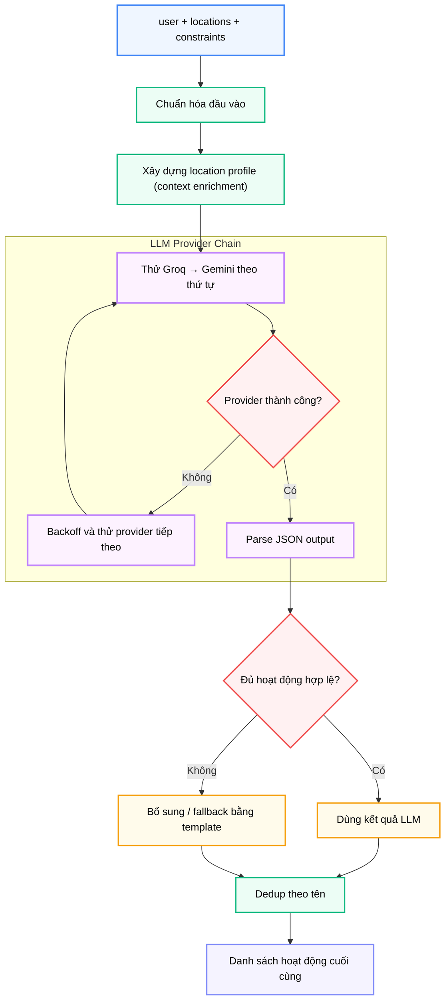

# Module N5: Sinh Hoạt động Du lịch

**Dự án:** Travel Experience Planner  
**Ngày:** 2026-05-21

---

## 1. Vai trò của Module N5

Sau khi hệ thống xác định được "nên đi đâu", N5 trả lời câu hỏi tiếp theo: "đến đó thì nên làm gì?". Đây là module sáng tạo nội dung của pipeline, nhưng đồng thời cũng là module phải kiểm soát chất lượng rất chặt, vì đầu ra của nó không chỉ để hiển thị mà còn được xếp hạng và giải thích ở các bước sau.

Do đó, N5 phải thỏa mãn đồng thời hai mục tiêu tưởng như mâu thuẫn:

- **sáng tạo đủ tốt** để hoạt động nghe hợp lý và hấp dẫn
- **ổn định đủ cao** để luôn trả ra output có cấu trúc chuẩn

Chính vì vậy, N5 được thiết kế như một hệ thống **LLM-first, template-backup** thay vì phụ thuộc hoàn toàn vào sinh ngôn ngữ tự do.

Trong kiến trúc v2, N5 còn đóng vai trò **fallback cuối** trong pipeline hoạt động: trước tiên N8 ưu tiên hoạt động đã cào từ N9–N14 trong database; chỉ khi database trả về ít hơn ngưỡng tối thiểu mới gọi N5.

---

## 2. Tư tưởng thiết kế: LLM-first, Template-backup

### 2.1. Vì sao không chỉ dùng template?

Nếu chỉ dùng template:

- hoạt động sẽ an toàn nhưng dễ lặp và thiếu ngữ cảnh
- không phản ánh đặc thù từng địa điểm
- khó tạo cảm giác "đề xuất thông minh và cá nhân hóa"

### 2.2. Vì sao không chỉ dùng LLM?

Nếu chỉ dùng LLM:

- đầu ra dễ lệch schema (thiếu trường, sai kiểu dữ liệu)
- chất lượng dao động theo model, nhiệt độ sampling và tình trạng API
- dễ gặp lỗi rate limit (HTTP 429) hoặc timeout
- không có lưới an toàn khi pipeline cần chạy liên tục

### 2.3. Lý do chọn kiến trúc hybrid và thứ tự ưu tiên

N5 chọn chiến lược lai vì đây là điểm cân bằng tốt giữa sáng tạo và ổn định. Đồng thời, trong kiến trúc tổng thể, thứ tự ưu tiên là:

1. Hoạt động đã được cào và enrich từ N9–N14 (dữ liệu thực từ các bản đồ lớn)
2. N5 LLM generation (sáng tạo, cá nhân hóa)
3. N5 template expansion (luôn có kết quả, đúng schema)

Cách phân lớp này đảm bảo hệ thống luôn trả về hoạt động — dù API LLM có sự cố hay database chưa có dữ liệu cho địa điểm đó.

---

## 3. Cấu trúc module

```
backend/modules/n5_activity_generation/
├── __init__.py                  # Re-export generate_activities
├── n5_activity_generator.py     # Orchestration: normalize → LLM → template → dedup
├── n5_llm_generator.py          # Xây dựng prompt và parse JSON từ LLM
├── n5_activity_templates.py     # Ngân hàng template theo loại và hồ sơ địa điểm
├── providers/
│   ├── __init__.py              # get_llm_chain() — trả danh sách provider ưu tiên
│   ├── base.py                  # Lớp cơ sở LLMProvider: retry và rate-limit logic
│   ├── groq_provider.py         # Provider Groq API
│   └── gemini_provider.py       # Provider Gemini API
└── requirements.txt
```

---

## 4. API công khai

```python
from modules.n5_activity_generation import generate_activities
from backend.shared.contracts.n5_contracts import N5GenerateInput

generate_activities(data: Union[N5GenerateInput, dict]) -> dict
```

Áp dụng xác thực **Pydantic V2** tại biên module.

---

## 5. Contract đầu vào và đầu ra

### 5.1. Đầu vào

```python
class N5GenerateInput(BaseModel):
    user: N5UserInput                   # Sở thích người dùng
    locations: List[N5LocationItem]     # Địa điểm cần sinh hoạt động
    constraints: Optional[N5Constraints]  # Ràng buộc thời gian trong ngày
    provider_override: Optional[str]    # Ép dùng provider cụ thể (tùy chọn)
```

### 5.2. Đầu ra

```python
{
    "activities": [
        {
            "activity_id": str,        # {source}_{location_id}_{hash6}
            "location_id": str,
            "metadata": {
                "name": str,
                "description": str,
                "tags": list[str],
                "activity_type": str,  # adventure|relaxation|food|culture|nightlife|nature|shopping
                "intensity": float,
                "physical_level": float | None,
                "social_level": float | None,
            }
        }
    ],
    "metadata": {
        "per_location": [...],  # provider, model, usage, latency cho từng địa điểm
        "latency_ms": int,
    }
}
```

Output có hai lớp giá trị:

- `activities`: dữ liệu để hiển thị và xếp hạng tiếp theo bởi N6
- `metadata`: dữ liệu để quan sát chất lượng generation và benchmark provider

---

## 6. Quy trình sinh hoạt động



---

## 7. LLM Provider Chain

N5 sử dụng chuỗi provider có thứ tự ưu tiên, quản lý bởi `providers/registry.py`:

- **Groq** (chính): nhanh, miễn phí, nhưng có rate limit nghiêm ngặt
- **Gemini** (dự phòng): dùng khi Groq thất bại hoặc bị rate limit

Mỗi provider kế thừa từ `providers/base.py`, có:

- logic retry theo cấp số nhân (exponential backoff)
- nhận diện HTTP 429 và xử lý riêng
- RPM-limit awareness

Chain này còn được dùng lại bởi `processor.py` của activity_retrievals để enrich description tiếng Việt cho các hoạt động đã cào từ N9–N14.

---

## 8. Context Enrichment trước Generation

N5 không chỉ đọc metadata địa điểm một cách thụ động. Module xây dựng **location profile** phong phú hơn từ tên, tags, description và profile mẫu nếu có. LLM sinh hoạt động tốt hơn nhiều khi được cung cấp ngữ cảnh địa điểm rõ ràng: đặc điểm địa hình, vùng miền, loại địa danh.

Đây là kỹ thuật **context enrichment before generation** — giảm tỷ lệ output chung chung và không đúng ngữ cảnh.

---

## 9. Ý nghĩa của ba trục hành vi trong output

Mỗi hoạt động không chỉ có `name` và `description` mà còn có:

- `intensity`: mức độ kịch tính / phiêu lưu
- `physical_level`: mức đòi hỏi thể lực
- `social_level`: mức độ phù hợp đi nhóm

Đây không chỉ là metadata hiển thị — ba trục này là **đầu vào cho N6**. N5 đang sinh ra "ứng viên có cấu trúc có thể chấm điểm tiếp", không chỉ sinh "nội dung đẹp".

---

## 10. Ghi chú vận hành

- Module short-circuit về kết quả rỗng nếu cấu hình target count bằng `0`
- Template engine dùng variation modifiers để tránh các hoạt động trùng lặp
- Có logic boost tỷ lệ hoạt động sightseeing để duy trì đa dạng loại hình
- Trong pipeline v2, N5 chỉ được gọi khi database trả về ít hơn ngưỡng tối thiểu

---

## 11. Kết luận

N5 là nơi hệ thống bước từ retrieval sang generation. Giá trị lớn nhất của module không nằm ở việc gọi LLM, mà ở cách kiểm soát rủi ro của generation:

- enrich ngữ cảnh địa điểm trước khi sinh
- dùng LLM khi có lợi thế, template khi cần ổn định
- giữ đầu ra luôn có cấu trúc chặt chẽ
- đóng vai trò fallback cuối trong chuỗi ưu tiên hoạt động

---

## 12. Tài liệu tham khảo

| # | Chủ đề | Nguồn tham khảo |
|---|---|---|
| 1 | Groq Structured Outputs | [console.groq.com/docs](https://console.groq.com/docs) |
| 2 | Gemini API | [ai.google.dev/docs](https://ai.google.dev/docs) |
| 3 | JSON Schema | [json-schema.org](https://json-schema.org/) |
| 4 | Activity Retrievals (N9–N14) | [modules/n9_n14_activity_retrievals.md](n9_n14_activity_retrievals.md) |
