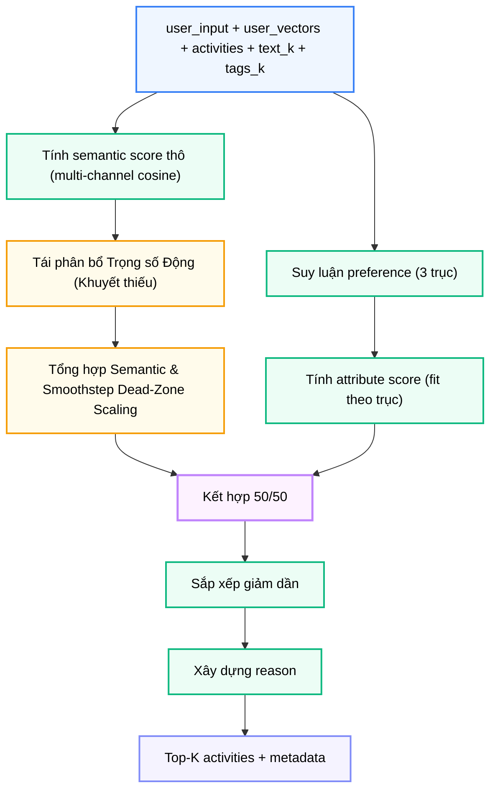

# Module N6: Xếp hạng Hoạt động

**Dự án:** Travel Experience Planner  
**Ngày:** 2026-05-21

---

## 1. Vai trò của Module N6

N6 là lớp ra quyết định cuối cùng cho danh sách hoạt động. Sau khi hoạt động được thu thập từ database (N9–N14) hoặc N5 LLM, N6 xác định hoạt động nào thực sự phù hợp nhất với người dùng tại thời điểm hiện tại.

Điểm đặc biệt của N6 là nó không chỉ xét "hoạt động này có liên quan về mặt ngữ nghĩa hay không", mà còn xét:

- mức độ sôi nổi và phiêu lưu (`intensity`)
- độ đòi hỏi thể lực (`physical_level`)
- tính phù hợp đi nhóm hay cá nhân (`social_level`)

Nhờ đó, hệ thống không chỉ trả hoạt động "đúng chủ đề", mà còn cố gắng trả hoạt động "đúng phong cách" cho người dùng đó.

---

## 2. Tư tưởng thiết kế: Hybrid Scoring

### 2.1. Giới hạn của semantic-only ranking

Nếu chỉ dựa vào semantic similarity, hai hoạt động có thể có độ tương đồng vector rất gần nhưng khác nhau hoàn toàn về trải nghiệm thực tế. Ví dụ:

- "Trekking xuyên rừng đỉnh Fansipan" — cường độ cao, đòi hỏi thể lực
- "Ngắm cảnh từ cáp treo Fansipan" — nhẹ nhàng, phù hợp gia đình

Cả hai đều gần nhau về ngữ nghĩa "khám phá đỉnh Fansipan", nhưng phù hợp với hai nhóm người dùng hoàn toàn khác nhau.

### 2.2. Lý do chọn hybrid 50/50

N6 kết hợp hai thành phần với trọng số bằng nhau:

```
final_score = 0.5 × semantic_score + 0.5 × attribute_score
```

- **Semantic** đảm bảo đúng chủ đề và ngữ cảnh
- **Attribute** đảm bảo đúng phong cách và nhịp độ

Tỷ lệ 50/50 là một lựa chọn cân bằng: nếu nghiêng quá về semantic, hệ thống sẽ giống một search engine; nếu nghiêng quá về attribute, hệ thống có thể đề xuất hoạt động không liên quan nhưng phù hợp "phong cách".

---

## 3. Cấu trúc module

```
backend/modules/n6_activity_ranking/
├── __init__.py          # Re-export rank_activities
├── rank_activities.py   # Logic tính điểm, trộn, chuẩn hóa
├── preferences.py       # Suy luận sở thích rule-based (3 trục)
└── requirements.txt
```

---

## 4. API công khai

```python
from modules.n6_activity_ranking import rank_activities
from backend.shared.contracts.n6_contracts import N6RankInput

rank_activities(data: Union[N6RankInput, dict]) -> dict
```

Áp dụng xác thực **Pydantic V2** tại biên module.

---

## 5. Contract đầu vào và đầu ra

### 5.1. Đầu vào

```python
class N6RankInput(BaseModel):
    text_k: int = 0
    tags_k: int = 0
    user_input: UserInput          # Text, tags, img_desc gốc để suy luận preference
    user_vectors: UserVectors      # Bốn kênh vector từ N1
    activities: List[Dict] = []    # Ứng viên từ N3 (v2) hoặc N5 (v1)
    top_k: int = 5
```

### 5.2. Đầu ra

```python
class N6RankOutput(BaseModel):
    activities: List[RankedActivityItem]
    metadata: Dict[str, Any]  # user_prefs, weights, text_k, tags_k, latency_ms
```

```python
class RankedActivityItem(BaseModel):
    activity_id: Optional[str] = None
    location_id: Optional[str] = None
    score: float = 0.0
    reason: Optional[str] = ""
```

`metadata.user_prefs` phơi bày ra ngoài kết quả suy luận preference — hệ thống không xếp hạng theo hộp đen, mà có một tầng phân tích hành vi rõ ràng trước khi chấm điểm.

---

## 6. Semantic Score và Phân bổ Trọng số Động

Semantic score dùng cùng tinh thần multi-channel retrieval như N4, nhưng so khớp với vector hoạt động thay vì vector địa điểm:

| Kênh truy vấn | Kênh hoạt động | Ý nghĩa |
|---|---|---|
| `aug_tags` | `aug_tags` | Ontology tag người dùng vs. tag hoạt động |
| `aug_text` | `text` | Text mở rộng vs. mô tả hoạt động |
| `text` | `text` | Text gốc vs. mô tả hoạt động |

### 6.1. Phân bổ Trọng số động theo Kênh Existing & Missing
Tương tự N4, nếu một kênh đầu vào bị trống, trọng số của nó sẽ tự động được **thu hồi và tái phân bổ tỉ lệ thuận** cho các kênh hiện có (Existing Channels).
`Weight_effective(c) = (Weight_raw(c) * is_active(c)) / Sum(Weight_raw(k) * is_active(k))`

### 6.2. Absolute Smoothstep Dead-Zone Scaling
Sau khi tổng hợp điểm thô, điểm ngữ nghĩa không sử dụng Min-Max cưỡng bức (chia cho max) hay kéo giãn tuyến tính `(score - 0.5) * 2` nữa. 
Nó được đưa qua hàm định hình phi tuyến **Absolute Smoothstep Dead-Zone Scaling**:

```python
shaped = smoothstep(0.15, 0.65, raw_score)
sem_score_scaled = 0.65 + shaped * 0.30
```

### Vì sao cần Smoothstep Dead-Zone Scaling?

Trong cùng một domain du lịch, nhiều embedding thường có cosine similarity khá cao với nhau. Cơ chế định hình này giúp:
1. Tạo ra **vùng lõi an toàn (0.65)** làm điểm xuất phát vững chắc thay vì `0.0` khắc nghiệt.
2. Nới rộng khoảng cách điểm ở vùng quan trọng để phân tách rõ nhóm xuất sắc (90-95%) và nhóm trung bình (70-80%).
3. Giữ nguyên tính trung thực của không gian vector (kết quả tệ không bị bơm phồng ảo).

---

## 7. Attribute Score và Suy luận Sở thích

`preferences.infer_user_preferences()` phân tích `user_input` và suy luận ba trục preference:

| Trục | Ý nghĩa | Nguồn tín hiệu |
|---|---|---|
| `intensity` | Thích kịch tính / mạo hiểm | Tags (adventure, trekking...), từ khóa text |
| `physical` | Thích vận động cơ thể | Tags (trekking, cycling...), từ khóa text |
| `social` | Thích đi nhóm / đông người | Tags (family, group...), từ khóa text/img_desc |

Mỗi trục được tính qua ba bước:

1. **Tag lookup**: tags người dùng chọn tra trong bảng `_TAG_WEIGHTS`, mỗi tag cộng điểm dương hoặc âm cho từng trục
2. **Keyword scan**: scan text và `img_desc` với bảng từ khóa tiếng Việt và tiếng Anh (từ N2), cộng bonus nhỏ hơn
3. **Sigmoid**: kết quả thô được đưa qua sigmoid `[0, 1]`; nếu ít tín hiệu → `None`

Trục có giá trị `None` được **bỏ qua** trong attribute scoring — không phạt hoạt động vì thiếu metadata phụ.

### Vì sao rule-based thay vì LLM?

- Deterministic — cùng input luôn ra cùng output
- Dễ trace trong report và benchmark
- Chi phí thấp, không thêm API call
- Đủ biểu đạt cho các sở thích du lịch phổ biến

---

## 8. Luồng xử lý



---

## 9. Chuỗi reason

N6 trả `reason` cho mỗi hoạt động được xây dựng từ:

- loại hoạt động (`activity_type`)
- highlights khi semantic hoặc attribute score đủ mạnh

Đây không phải LLM-generated reasoning mà là **explanation có cấu trúc** bám sát số liệu tính toán — luôn truy vết được và nhất quán.

---

## 10. Ghi chú vận hành

- Nếu không có hoạt động đầu vào, module trả danh sách rỗng — không báo lỗi
- Nếu không có kênh semantic khả dụng, semantic score về mức trung tính
- Nếu không suy luận được trục preference nào, attribute score cũng về mức trung tính
- N8 ánh xạ key `tag` (schema cũ của N3) thành `aug_tags` trước khi truyền sang N6

---

## 11. Kết luận

N6 là nơi recommendation hoạt động đạt tới mức "cá nhân hóa hành vi" thay vì chỉ "khớp chủ đề". Sự kết hợp giữa semantic matching, rule-based preference inference và attribute-level scoring cho phép hệ thống ưu tiên đúng loại trải nghiệm phù hợp với nhịp độ và phong cách của từng người dùng.

---

## 12. Tài liệu tham khảo

| # | Chủ đề | Nguồn tham khảo |
|---|---|---|
| 1 | Cosine similarity trong retrieval | [pinecone.io/learn/vector-similarity](https://www.pinecone.io/learn/vector-similarity/) |
| 2 | Dynamic weighting | [docs/architecture/dynamic_weighting.md](../architecture/dynamic_weighting.md) |
| 3 | Sigmoid function | [en.wikipedia.org/wiki/Sigmoid_function](https://en.wikipedia.org/wiki/Sigmoid_function) |
