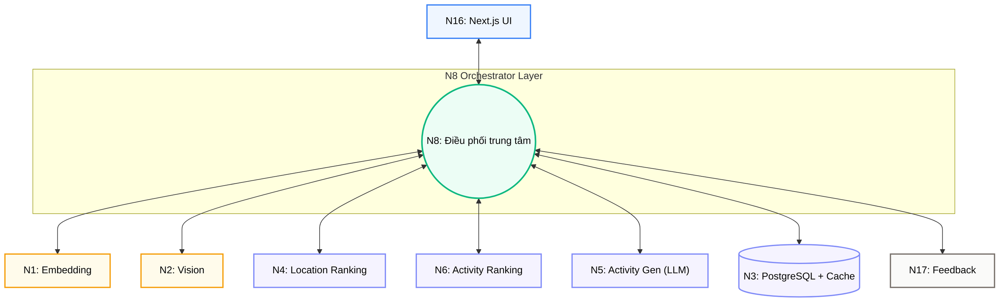
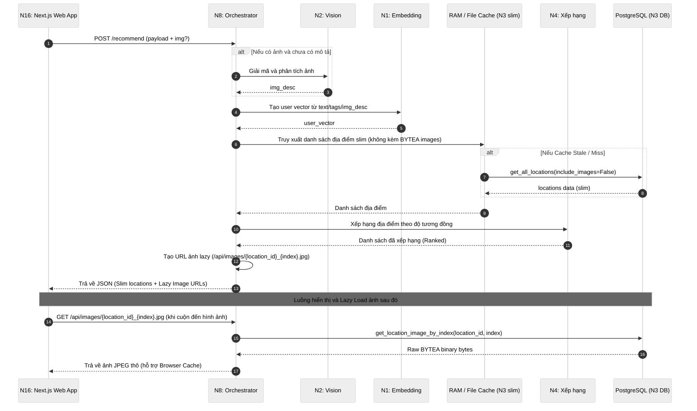
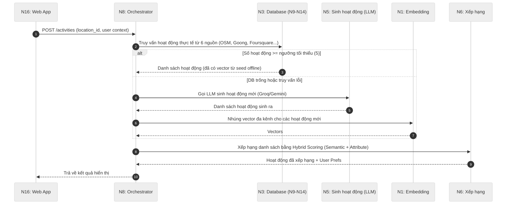
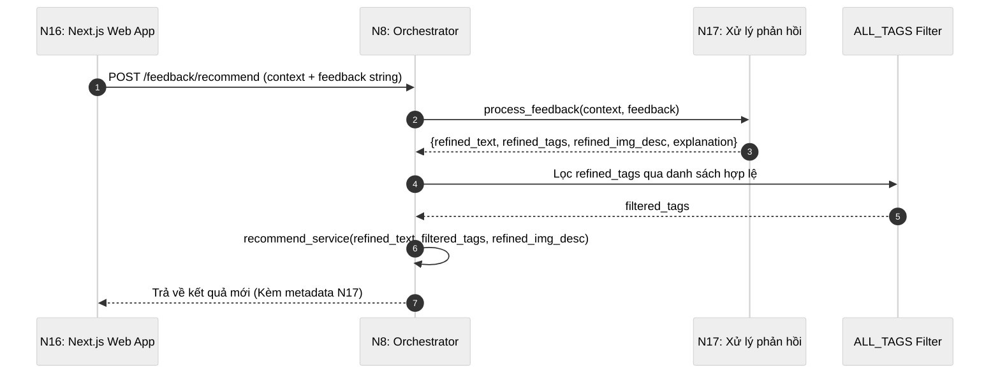
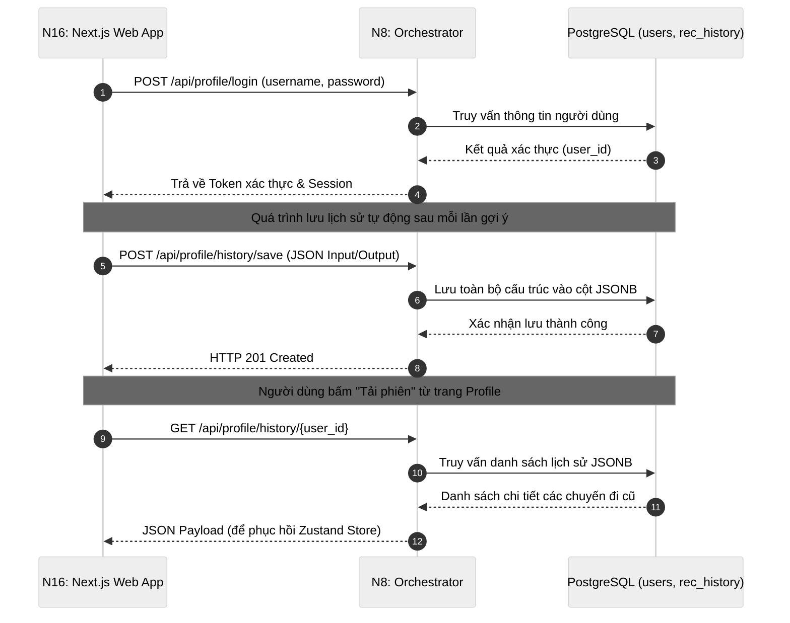
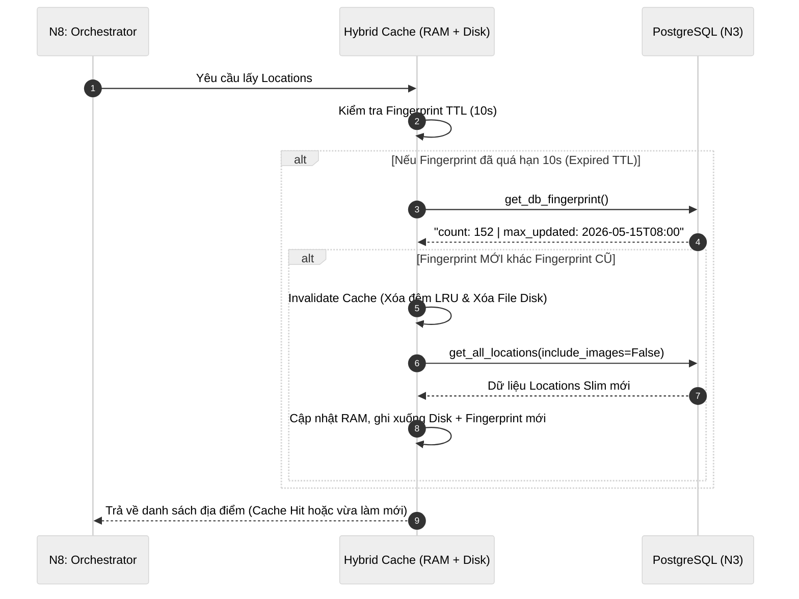

# Module N8: Điều phối API (Orchestrator)

**Dự án:** Travel Experience Planner  
**Ngày:** 2026-05-21

---

## 1. Vai trò của Module N8

N8 là trung tâm điều phối của hệ thống. Đây là nơi mọi request từ frontend đi vào, nơi các workflow được lắp ghép đúng thứ tự, và cũng là nơi xử lý các concern vận hành như bảo vệ route, cache, enrich response, phòng chống lỗi sập (anti-crash) và debug trace.

N8 đóng vai trò **application coordinator**. Nó không thay thế các module chuyên môn (nhúng, xếp hạng, sinh nội dung), mà giữ cho:

- dữ liệu đi đúng đường, kết nối N16 UI với các module xử lý AI và Database
- output của module này phù hợp với input của module kia
- kiểm soát rate limit của LLM và bảo vệ kết nối Database
- phản hồi cuối cùng được định dạng phù hợp với nhu cầu của UI

### Sơ đồ tương tác hệ thống (Orchestrator Coordination Flow)

---

## 2. Chiến lược kiến trúc: Tại sao chọn Flask & Synchronous?

Một câu hỏi kiến trúc thường gặp là tại sao không dùng FastAPI để tận dụng tính bất đồng bộ (async). Tuy nhiên, với đặc thù dự án này, Flask và cơ chế Synchronous là lựa chọn tối ưu hơn vì:

1. **Kiểm soát Rate Limit (Tránh lỗi 429)**: Hệ thống sử dụng các LLM ở tầng miễn phí (Free Tier như Groq), việc xử lý async/parallel sẽ lập tức dẫn đến nghẽn cổ chai và lỗi HTTP 429. Synchronous đóng vai trò "bộ điều tiết tự nhiên", đảm bảo các yêu cầu được gửi đi theo hàng đợi tuần tự.
2. **Bản chất tuần tự của AI Pipeline**: Các bước xử lý (Vision → Embedding → Ranking) bắt buộc phải chạy tuần tự vì bước sau cần kết quả của bước trước. Việc dùng `async` không mang lại lợi ích tốc độ ở luồng chính.
3. **Đơn giản hóa Debug**: Debug module AI synchronous dễ dàng và tin cậy hơn nhiều so với việc quản lý event loop phức tạp.

---

## 3. Workflow Gợi ý Địa điểm (Location Service)

Luồng `recommend_service()` thực hiện:

1. Tiếp nhận input (text, tags, ảnh tải lên)
2. Gọi N2 để chuyển ảnh sang mô tả văn bản (nếu có)
3. Gọi N1 để nhúng vector đa kênh
4. Nạp dữ liệu địa điểm slim từ cache (hoặc N3 DB)
5. Gọi N4 để xếp hạng địa điểm
6. Đính kèm URL ảnh lazy-loading và trả về N16

N8 không đẩy trực tiếp ảnh Base64 dung lượng lớn vào API response. Thay vào đó, N8 áp dụng cơ chế **Lazy Image Loading**:
- Chỉ trả về URL dạng `/api/images/{location_id}_{idx}.jpg`
- Khi người dùng cuộn UI đến ảnh nào, ảnh đó mới được load từ PostgreSQL

Điều này giúp giảm thời gian tải ban đầu xuống vài chục milliseconds, tối ưu hóa triệt để bộ nhớ đệm RAM.

---

## 4. Workflow Sinh Hoạt động (Activities V2 Service)

Trong phiên bản hệ thống mới (v2), N8 không còn phụ thuộc hoàn toàn vào LLM để sinh hoạt động. N8 sử dụng chiến lược **Database-first với LLM Fallback**:

Chiến lược này giúp hệ thống phản hồi cực nhanh (vì dữ liệu đã được N9-N14 cào sẵn), đồng thời luôn có lưới an toàn LLM nếu địa điểm chưa được phủ sóng.

---

## 5. Cơ chế chống sập (Anti-Crash Mechanisms)

N8 là lá chắn thép bảo vệ sự sống còn của pipeline. Nó tích hợp các cơ chế bảo vệ cấp độ hệ thống:

### 5.1. Chống sập Database (Circuit Breaker & Fallback JSON)
- Khi kết nối Postgres (N3) bị gián đoạn (do quá tải hoặc sập mạng), N8 sử dụng **Circuit-Breaker**.
- Sau 3 lần kết nối thất bại với cấp số nhân thời gian chờ, N8 ngắt kết nối vật lý và chuyển trạng thái sang **MỞ (OPEN)** trong 30 giây.
- Trong lúc này, mọi yêu cầu đọc/ghi tự động chuyển hướng về file JSON lưu tạm (`fallback_db.json`) trên đĩa cứng máy chủ, đảm bảo N16 vẫn có dữ liệu để hiển thị.

### 5.2. Chống sập LLM (Rate Limit Retry & Offline Template Engine)
- Nếu Groq API trả mã `429 Too Many Requests` hoặc sập hệ thống, N8 kết hợp N5 tự động retry hoặc đổi provider sang Gemini.
- Nếu LLM hoàn toàn tê liệt, hệ thống kích hoạt **Template Engine ngoại tuyến** để sinh nội dung thay thế dựa trên location profile, đảm bảo quá trình không bao giờ bị gián đoạn bằng một error 500.
- Fallback cuối cùng là một danh sách rỗng an toàn `[]` để UI không crash.

### 5.3. Bảo vệ Request & Chống nhấp nháy UI
- Các API route nội bộ đều yêu cầu `X-Internal-Key` chống timing attack qua `hmac.compare_digest`.
- Tích hợp bộ lọc **Thread-safe Request Fingerprint**: nếu người dùng bấm nút tìm kiếm liên tục, request đúp sẽ bị block trả về `409 Conflict` để bảo vệ tài nguyên LLM đắt đỏ.

---

## 6. Vòng phản hồi tinh chỉnh truy vấn

N8 không chỉ gọi luồng một chiều. Với endpoint `/feedback`, N8 tích hợp module N17:

1. N16 gửi context hiện tại + chuỗi phản hồi (VD: "Tôi muốn đi chỗ nào yên tĩnh hơn")
2. N8 gửi vào N17 để phân tích và tinh chỉnh tham số `text`, `tags`
3. Sau khi nhận tham số mới, N8 tự động chạy lại luồng `recommend_service` hoặc `activities_v2_service` ngay bên trong nội bộ, mà không bắt N16 phải gọi thêm API.
4. Điều này giúp kiến trúc feedback loop khép kín tại lớp Orchestrator.

---

## 7. Workflow Quản lý Người dùng & Lịch sử (User Profiles)

N8 chịu trách nhiệm điều phối toàn bộ dữ liệu lịch sử và xác thực qua các endpoint `/api/profile/*`. Đây là tính năng rất quan trọng giúp hệ thống hỗ trợ khôi phục phiên (JSONB Restore) mà không tốn chi phí gọi lại LLM.

Điều này minh chứng khả năng của N8 trong việc không chỉ đóng vai trò proxy cho AI mà còn xử lý trọn vẹn nghiệp vụ ứng dụng Web.

---

## 8. Cơ chế Đồng bộ Cache (Hybrid Caching & Fingerprint)

Để cân bằng giữa tốc độ đọc và dung lượng lưu trữ, N8 triển khai cơ chế **Hybrid Cache (RAM + Disk File Cache)** kết hợp với kiểm tra Fingerprint TTL.
- **RAM Cache (LRU)**: Chứa các response nhỏ, request thường xuyên để trả về < 10ms.
- **Disk Cache (File-based)**: Lưu trữ các mảng dữ liệu lớn hơn (nhưng vẫn không chứa Base64 ảnh) để giải phóng RAM, tránh Out-of-Memory.

Thay vì hash toàn bộ dữ liệu Postgres (rất nặng) hoặc bỏ qua cache (rất chậm), N8 chỉ lấy một chuỗi băm siêu nhẹ chứa `MAX(updated_at)` và `COUNT(*)` từ DB, và giữ nó trong 10 giây (TTL).

Cơ chế này ngăn chặn tình trạng N8 query liên tục xuống ổ cứng mỗi khi người dùng tìm kiếm, nhưng vẫn đảm bảo nếu có bản ghi mới trong DB, UI sẽ nhận được chậm nhất sau 10 giây.

---

## 9. Kết luận

N8 không xử lý logic AI trực tiếp, nhưng quyết định cách các khối AI hoạt động cùng nhau. Những tinh chỉnh như Lazy Image Loading, Database-first Fallback, và Circuit-Breaker biến N8 từ một "router" đơn giản thành một Orchestrator cấp độ production có khả năng chịu tải, chịu lỗi và phục hồi mạnh mẽ.

---

## 8. Tài liệu tham khảo

| # | Chủ đề | Nguồn tham khảo |
|---|---|---|
| 1 | Circuit Breaker Pattern | [martinfowler.com/bliki/CircuitBreaker](https://martinfowler.com/bliki/CircuitBreaker.html) |
| 2 | Flask Documentation | [flask.palletsprojects.com](https://flask.palletsprojects.com/) |
| 3 | N9-N14 Activity Retrievals | [modules/n9_n14_activity_retrievals.md](n9_n14_activity_retrievals.md) |
