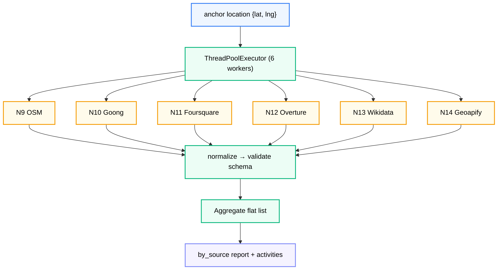

# Module N9–N14: Thu thập Hoạt động Đa Nguồn

**Dự án:** Travel Experience Planner  
**Ngày:** 2026-05-21

---

## 1. Vai trò của nhóm module N9–N14

N9–N14 là lớp thu thập dữ liệu POI (Point of Interest) thực tế cho hệ thống. Thay vì chỉ dựa vào N5 LLM để sinh hoạt động, hệ thống xây dựng một **cơ sở dữ liệu hoạt động từ sáu nguồn bản đồ lớn**, được thu thập, chuẩn hóa và lưu vào PostgreSQL trong một bước seed ngoại tuyến.

Kết quả là: khi người dùng yêu cầu hoạt động cho một địa điểm, N8 truy vấn trực tiếp database đã có sẵn dữ liệu thực tế — không cần gọi API bên ngoài và không phụ thuộc vào LLM trong real-time.

Đây là một chuyển đổi kiến trúc quan trọng từ "LLM-only" sang **"database-first với LLM fallback"**.

---

## 2. Tư tưởng thiết kế: Database-first Activity Pipeline

### 2.1. Vì sao không chỉ dùng N5 LLM để sinh hoạt động?

Trong phiên bản đầu tiên của hệ thống, N5 chịu trách nhiệm toàn bộ việc sinh hoạt động. Hướng đó có nhiều rủi ro:

- **Không ổn định:** LLM có thể bị rate limit, timeout, hoặc trả về schema sai
- **Thiếu dữ liệu thực tế:** hoạt động sinh ra bởi LLM không có tọa độ GPS, giờ mở cửa, hay rating thực tế
- **Không kiểm soát được tính xác thực:** LLM có thể "bịa" địa điểm không tồn tại
- **Chi phí cao:** mỗi request đều tốn API call

### 2.2. Lý do chọn kiến trúc seed + serve

Kiến trúc mới tách biệt hai giai đoạn:

1. **Seed (ngoại tuyến):** Thu thập từ N9–N14, normalize, enrich mô tả bằng N5 LLM, lưu vào PostgreSQL
2. **Serve (real-time):** N8 truy vấn database đã chuẩn bị sẵn → không cần gọi API bên ngoài

Điều này mang lại:

- **Độ tin cậy cao:** dữ liệu từ OpenStreetMap, Foursquare, Wikidata... là dữ liệu thực tế, được kiểm chứng
- **Tốc độ phản hồi nhanh hơn:** truy vấn PostgreSQL nhanh hơn nhiều so với gọi LLM
- **Thông tin phong phú hơn:** có tọa độ GPS, khoảng cách từ địa điểm anchor, rating, giờ mở cửa, website
- **N5 LLM vẫn là fallback:** khi database có ít hơn ngưỡng tối thiểu hoạt động cho một địa điểm

### 2.3. Vì sao cần sáu nguồn?

Không một nguồn nào bao phủ đầy đủ:

| Nguồn | Thế mạnh | Hạn chế |
|---|---|---|
| OSM | Phủ rộng, địa danh nông thôn | Thiếu rating và mô tả |
| Goong | Phù hợp địa bàn Việt Nam | Không có tọa độ từ Autocomplete |
| Foursquare | Rating + category phong phú | Giới hạn request miễn phí |
| Overture | Mở, có geometry đầy đủ | Taxonomy còn đang phát triển |
| Wikidata | Notable landmarks, có lịch sử | Thưa cho địa điểm nhỏ |
| Geoapify | Phân loại chi tiết | Chi phí API |

Dùng cả sáu nguồn, sau khi dedup, tạo ra một bộ hoạt động đa dạng và bổ trợ cho nhau.

---

## 3. Cấu trúc package

```
backend/modules/activity_retrievals/
├── __init__.py              # API công khai: retrieve_all, process_activities, schema helpers
├── orchestrator.py          # Fan-out 6 retrievers song song, normalize, aggregate
├── processor.py             # Filter → score → balance → LLM enrich → persist
├── dedup.py                 # Dedup cross-source (geo cluster + name similarity)
├── schema.py                # Unified schema factory, validator, constants, helpers
├── SCHEMA.md                # Đặc tả schema chi tiết (companion document)
├── normalizers/
│   ├── osm.py / goong.py / foursquare.py / overture.py / wikidata.py / geoapify.py / llm.py
│   └── shared.py            # Helpers dùng chung (haversine, category mapping)
├── n9_osm/retriever.py      # fetch_osm_nearby() qua Overpass API
├── n10_goong/retriever.py   # fetch_goong_nearby() qua Goong Autocomplete
├── n11_foursquare/retriever.py
├── n12_overture/retriever.py
├── n13_wikidata/retriever.py  # fetch_wikidata_nearby() qua SPARQL
└── n14_geoapify/retriever.py
```

---

## 4. API công khai

```python
from backend.modules.activity_retrievals import retrieve_all, process_activities
```

### 4.1. retrieve_all()

```python
result = retrieve_all(
    location={"location_id": "loc_001", "lat": 22.30, "lng": 103.77},
    radius=20000,   # mét (mặc định)
    sources=None,   # None = chạy cả 6 nguồn
    validate=True,  # schema validate từng activity
    dedupe=False,   # cross-source dedup (mặc định tắt, xem processor)
)
```

Trả về:
```python
{
    "location_id": str,
    "anchor": {"lat": float, "lng": float},
    "radius_m": int,
    "activities": [...],   # Flat list từ tất cả nguồn
    "by_source": {source: {raw_count, normalized_count, valid_count, elapsed_s, error}},
    "total_activities": int,
    "total_elapsed_s": float,
}
```

### 4.2. process_activities()

Pipeline đầy đủ cho một anchor location — từ thu thập đến lưu file:

```python
result = process_activities(
    location={"location_id": "loc_001", "lat": 22.30, "lng": 103.77, "name": "Fansipan"},
    radius=20000,
    top_k=10,
    enrich_descriptions=True,  # Gọi N5 LLM để enrich tên + mô tả tiếng Việt
    persist=True,              # Ghi processed/{location_id}.json
)
```

---

## 5. Unified Activity Schema

Tất cả sáu nguồn được normalize về cùng một schema:

```jsonc
{
  "activity_id":  "{source}_{location_id}_{hash6}",
  "location_id":  "loc_001",
  "source":       "foursquare",
  "retrieved_at": "2026-05-11T07:23:14Z",
  "metadata": {
    "name":              "Sapa Rice Fields",
    "description":       "Ruộng bậc thang Sa Pa...",
    "activity_type":     "nature",       // 7 loại enum
    "activity_subtype":  "scenic_walk",
    "estimated_duration": 180.0,         // phút
    "price_level":       0.0,            // 0.0 (miễn phí) → 1.0 (rất đắt)
    "indoor_outdoor":    "outdoor",
    "time_of_day_suitable": "morning"
  },
  "place": {
    "coordinates":              {"lat": 22.30, "lng": 103.89},
    "distance_from_anchor_m":   12607,    // Haversine
    "address":                  { ... }
  },
  "signals": {
    "rating":        null,  // 0.0 → 1.0 (null nếu nguồn không có)
    "image_url":     null,
    "opening_hours": null,
    "website":       "https://..."
  },
  "provenance": {
    "raw_source_id": "56e62678498e553b7a719cf4",
    "source_url":    "https://foursquare.com/v/...",
    "merged_from":   []   // Chứa entries sau khi dedup
  }
}
```

### 5.1. Activity Type Enum

Tất cả nguồn đều map về 7 loại hoạt động:

`adventure` · `relaxation` · `food` · `culture` · `nightlife` · `nature` · `shopping`

### 5.2. Nguyên tắc null vs. default

- **`null`** = "nguồn này không có thông tin" — OSM thiếu `rating` → `null`
- **Không bịa default** để tránh skew điểm N6 — N6 đã có nhánh xử lý `null` với điểm trung tính 0.5

---

## 6. Luồng thu thập song song



Mỗi nguồn chạy trong thread riêng biệt (I/O-bound: chờ mạng). Lỗi của một nguồn được cô lập — không phá vỡ các nguồn còn lại.

---

## 7. Pipeline xử lý (processor.py)

Sau khi thu thập, `process_activities()` chạy qua các bước:

```mermaid
%%{init: {'flowchart': {'useMaxWidth': false}}}%%
graph LR
    classDef in fill:#eff6ff,stroke:#3b82f6,stroke-width:2px,color:#000000;
    classDef op fill:#ecfdf5,stroke:#10b981,stroke-width:2px,color:#000000;
    classDef llm fill:#fdf2ff,stroke:#c084fc,stroke-width:2.5px,color:#000000;
    classDef out fill:#f5f3ff,stroke:#818cf8,stroke-width:2px,color:#000000;

    A["~3700 raw activities"]:::in --> B["Filter: có coords + activity_type"]:::op
    B --> C["Drop anchor duplicates"]:::op
    C --> D["Quality score (field completeness)"]:::op
    D --> E["Sort: quality ↓, distance ↑"]:::op
    E --> F["Name dedup (O(N) pass)"]:::op
    F --> G["Source diversity cap"]:::op
    G --> H["Balance sightseeing/active 40/60"]:::op
    H --> I["N5 LLM enrich: Việt hóa tên + mô tả"]:::llm
    I --> J["Top-10 activities"]:::out
```



### 7.1. Quality Score

Điểm chất lượng tính theo mức độ đầy đủ field:

| Trường | Trọng số |
|---|---|
| `metadata.description` | 2.0 |
| `metadata.activity_type` | 1.5 |
| `signals.rating` | 1.5 |
| `metadata.indoor_outdoor` | 1.0 |
| `signals.image_url` | 1.0 |
| `metadata.estimated_duration` | 0.5 |
| `signals.opening_hours` | 0.5 |
| `signals.website` | 0.3 |

Điểm cuối `[0.0, 1.0]` = tổng trọng số có mặt / tổng tối đa.

### 7.2. Cân bằng sightseeing vs. active

N9–N14 thường trả về nhiều hoạt động `nature`/`culture` (ngắm cảnh thụ động). Để tránh danh sách kết quả quá một chiều, processor cân bằng theo tỷ lệ mặc định:

- 40% sightseeing (`nature`, `culture`)
- 60% active (`adventure`, `food`, `shopping`, `relaxation`, `nightlife`)

Nếu người dùng truyền `preferred_types` qua UI, tỷ lệ chuyển sang 70% preferred / 30% còn lại.

### 7.3. LLM Enrichment

Sau khi chọn được top kết quả, `_enrich_descriptions()` gọi N5 provider chain để:

- Việt hóa tên POI theo phong cách "trải nghiệm" (bắt đầu bằng động từ: Khám phá, Ngắm cảnh, Thưởng thức...)
- Sinh mô tả tiếng Việt súc tích, gợi cảm xúc cho mỗi POI

Một LLM call duy nhất cho toàn bộ top list — đảm bảo nhất quán ngôn ngữ và tiết kiệm token.

---

## 8. Deduplication Cross-source

`dedup.dedupe_activities()` loại bỏ các POI trùng lặp từ nhiều nguồn:

1. **Geo cluster**: activities trong bán kính ~50m là ứng viên cùng POI
2. **Name similarity**: trong cluster địa lý, activities có tên similar đủ ngưỡng được merge
3. **Canonical selection**: record "thắng" được chọn theo priority:

```
foursquare > overture > wikidata > geoapify > osm > goong > llm
```

Record bị absorbed ghi nhận trong `provenance.merged_from`.

> **Lưu ý:** Dedup đầy đủ hiện bị tắt trong `process_activities()` do chi phí O(28×N) tính toán similarity (~50s cho ~3700 items). Source diversity cap + filter đã cho chất lượng output chấp nhận được.

---

## 9. Activity ID Format

```
{source}_{location_id}_{hash6}
```

`hash6 = md5(raw_source_id or name).hexdigest()[:6]`

- **Global unique:** prefix nguồn khác nhau đảm bảo không đụng ID giữa các nguồn
- **Stable:** cùng `raw_source_id` → cùng `activity_id` → re-fetch idempotent

---

## 10. Per-source Mapping

| Module | Nguồn | API | Tọa độ | API Key |
|---|---|---|---|---|
| N9 | OpenStreetMap | Overpass API | Có (lat/lon) | Không |
| N10 | Goong Maps | Autocomplete | Không (cần Place Detail) | `GOONG_API_KEY` |
| N11 | Foursquare | Places API | Có | `FOURSQUARE_API_KEY` |
| N12 | Overture Maps | DuckDB/Parquet | Có | Không |
| N13 | Wikidata | SPARQL | Có (WKT) | Không |
| N14 | Geoapify | Places API | Có | `GEOAPIFY_API_KEY` |

Mỗi retriever expose một hàm `fetch_<source>_nearby(lat, lng, radius) -> list` và cache kết quả thô vào `cache/` để tránh gọi API lặp lại trong quá trình phát triển.

---

## 11. Ghi chú vận hành

- Mỗi nguồn chạy trong thread riêng — tối đa 6 workers đồng thời
- Lỗi một nguồn không ảnh hưởng các nguồn còn lại
- `drop_foreign_script()` loại bỏ activities có tên/mô tả bằng chữ Cyrillic, CJK, Hàn, Ả-rập — giảm noise từ tourist data quốc tế
- `strip_raw()` xóa `provenance.raw` trước khi lưu PostgreSQL để giảm kích thước row

---

## 12. Kết luận

N9–N14 là nền tảng dữ liệu thực tế của hệ thống hoạt động. Kiến trúc database-first giải quyết ba vấn đề lớn của LLM-only approach: độ tin cậy, tính xác thực và tốc độ phản hồi.

Ba điểm kỹ thuật đáng nhấn mạnh trong báo cáo:

1. **Multi-source fan-out song song** — cách tận dụng I/O concurrency mà không phức tạp hóa logic
2. **Unified schema** — cách thu gọn sáu API khác nhau thành một cấu trúc duy nhất có thể ranking được
3. **LLM enrichment ở bước cuối** — N5 được dùng đúng chỗ: không phải để sinh dữ liệu mà để Việt hóa và làm giàu thêm dữ liệu thực đã có

---

## 13. Tài liệu tham khảo

| # | Chủ đề | Nguồn tham khảo |
|---|---|---|
| 1 | OpenStreetMap Overpass API | [overpass-api.de](https://overpass-api.de/) |
| 2 | Foursquare Places API | [developer.foursquare.com](https://developer.foursquare.com/) |
| 3 | Wikidata SPARQL | [query.wikidata.org](https://query.wikidata.org/) |
| 4 | Overture Maps | [overturemaps.org](https://overturemaps.org/) |
| 5 | Geoapify Places | [apidocs.geoapify.com](https://apidocs.geoapify.com/) |
| 6 | Goong Maps API | [docs.goong.io](https://docs.goong.io/) |
| 7 | Unified schema | [activity_retrievals/SCHEMA.md](../../backend/modules/activity_retrievals/SCHEMA.md) |
