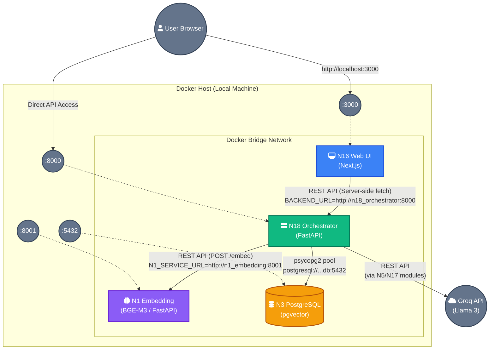

# Phase 1: Container Network Topology

This diagram illustrates the Docker Compose network topology established in Phase 1. It details how the Next.js frontend, FastAPI orchestrator, isolated embedding service, and PostgreSQL database communicate across the internal Docker bridge network (`travel-exp-planner-refloursihed_default`).

## Network Security & Routing Constraints

1. **Service Names over Localhost:** Containers must address each other using their Docker service names (e.g., `http://n18_orchestrator:8000`, `http://n1_embedding:8001`) because `127.0.0.1` inside a container resolves to itself, not the Docker host.
2. **Next.js Build-Time Baking:** Environment variables accessed by Next.js during `npm run build` (like `BACKEND_URL`) are baked into the container image. We must inject these variables as `ARG` during the Docker build stage so the Next.js API routes proxy requests to the correct internal container rather than falling back to `localhost`.
3. **Internal API Key:** An `INTERNAL_API_KEY` is enforced by N18 for backend routes. N16 injects this key into headers when making server-side `fetch` requests across the Docker network.
