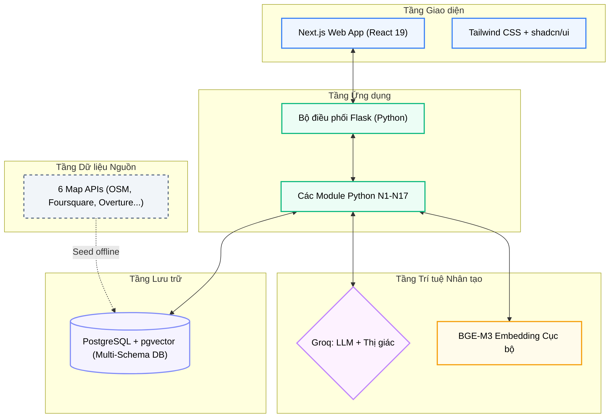

# Lý do Lựa chọn Công nghệ

**Dự án:** Travel Experience Planner  
**Ngày:** 2026-05-15

---

## 1. Mục tiêu của việc lựa chọn công nghệ

Việc chọn công nghệ cho dự án này không chỉ nhằm “dùng cái mới” hay “dùng cái phổ biến”, mà nhằm giải quyết một số ràng buộc rất cụ thể:

- cần semantic retrieval đủ mạnh
- cần generation đủ nhanh để demo và tương tác
- cần hạ tầng lưu trữ đủ đơn giản để quản lý trong phạm vi đồ án
- cần chi phí triển khai thấp hoặc có thể tự host

Vì vậy, mỗi lựa chọn công nghệ trong hệ thống đều là kết quả của một bài toán cân bằng giữa:

- hiệu năng
- chi phí
- độ phức tạp vận hành
- khả năng giải thích trong báo cáo

---

## 2. Tổng quan hệ sinh thái công nghệ

Sơ đồ cho thấy hệ thống chọn chiến lược khá rõ:

- frontend nhẹ
- orchestration tập trung
- embedding cục bộ
- generation/vision qua API
- persistence tập trung vào PostgreSQL

---

## 3. Vì sao chọn Groq cho LLM và Vision

### 3.1. Bài toán thực tế cần giải quyết

Ở hệ thống này, generation và vision không phải tính năng trang trí, mà là bước chạy trực tiếp trong user flow. Nếu LLM quá chậm:

- UI bị kéo dài thời gian chờ
- feedback loop kém tự nhiên
- demo end-to-end mất sức thuyết phục

Do đó, tốc độ inference là tiêu chí rất quan trọng.

### 3.2. Các lý do chính để chọn Groq

**1. Tốc độ inference cao**  
Groq nổi bật ở tốc độ xử lý, phù hợp với các bước:

- sinh hoạt động
- phân tích feedback
- mô tả ảnh

**2. Dễ xây dựng failover chain**  
Hệ thống generation hiện không phụ thuộc vào một model duy nhất. Điều này quan trọng vì free-tier hoặc shared-tier APIs rất dễ gặp:

- rate limit
- model overload
- response quality không ổn định

**3. Structured output phù hợp với pipeline**  
Nhiều bước của dự án yêu cầu JSON có cấu trúc rõ ràng. Khả năng structured output giúp giảm:

- lỗi parse
- lỗi schema
- chi phí hậu xử lý

**4. Chi phí hợp lý cho môi trường học thuật**  
Trong bối cảnh đồ án, chi phí là một ràng buộc thật. Groq phù hợp vì cho phép xây dựng pipeline đủ mạnh mà không yêu cầu ngân sách lớn ngay từ đầu.

### 3.3. Vì sao không dùng hoàn toàn OpenAI hay Gemini?

Không phải các lựa chọn kia không tốt, mà vì trong bối cảnh dự án này:

- Groq cho cảm giác phản hồi nhanh hơn
- chiến lược failover dễ tổ chức hơn trong cách cài đặt hiện tại
- chi phí thử nghiệm thấp hơn

Nói cách khác, đây là một lựa chọn tối ưu theo ràng buộc dự án, không phải tuyên bố rằng Groq tốt hơn trong mọi bối cảnh.

---

## 4. Vì sao chọn BGE-M3 cho embedding

Embedding là hạ tầng semantic quan trọng nhất của toàn hệ thống. Nếu phần này yếu, các bước ranking phía sau dù tinh chỉnh tốt đến đâu cũng khó bù lại.

### 4.1. Lý do lựa chọn

**1. Hỗ trợ đa ngôn ngữ tốt**  
Dữ liệu của hệ thống có thể pha trộn:

- tiếng Việt
- tiếng Anh
- tags ngắn
- cụm từ mở rộng

**2. Phù hợp cho retrieval**  
Mục tiêu của hệ thống không phải sinh văn bản từ embedding, mà là:

- so khớp ý định
- truy xuất semantic
- xếp hạng độ phù hợp

**3. Vector 1024 chiều đủ giàu biểu diễn**  
Đủ không gian để mang các sắc thái như:

- vibe
- bối cảnh
- cường độ trải nghiệm
- đặc trưng địa điểm

### 4.2. Vì sao embedding chạy cục bộ?

Embedding là thao tác lặp lại nhiều và rất gần lõi hệ thống. Giữ nó cục bộ mang lại lợi ích:

- giảm phụ thuộc mạng
- ổn định latency hơn
- dễ benchmark hơn
- không phát sinh chi phí API theo từng embedding

Đây là một lựa chọn rất đáng giá về mặt kiến trúc.

---

## 5. Vì sao chọn PostgreSQL + pgvector

### 5.1. Bài toán lưu trữ thực tế

Hệ thống không chỉ cần lưu:

- vector

mà còn phải lưu đồng thời:

- metadata địa điểm
- geo data
- ảnh nhị phân

Do đó, một vector database thuần có thể chưa phải lựa chọn thuận tiện nhất trong giai đoạn này.

### 5.2. Lợi ích của PostgreSQL + pgvector

**1. Giữ toàn bộ dữ liệu địa điểm trong một nguồn lưu trữ duy nhất**  
Điều này làm giảm độ phức tạp đồng bộ giữa:

- vector
- metadata
- ảnh

**2. SQL-native và quen thuộc**  
PostgreSQL có hệ sinh thái mature, rất tiện cho:

- reset dữ liệu
- debug
- query
- backup

**3. Có thể self-host và tránh vendor lock-in**  
Đây là một ưu điểm rất mạnh trong bối cảnh triển khai đồ án hoặc mở rộng nhỏ.

**4. Hỗ trợ vector trực tiếp qua pgvector**  
Nghĩa là hệ thống không phải hi sinh semantic retrieval để đổi lấy sự đơn giản lưu trữ.

### 5.3. Vì sao không dùng Pinecone hay Weaviate?

Các vector DB chuyên dụng có lợi thế riêng, nhưng trong bối cảnh hiện tại:

- làm tăng phân mảnh lưu trữ
- tăng chi phí vận hành
- tăng độ khó khi muốn giữ ảnh và metadata đồng bộ cùng vector

Do đó, PostgreSQL + pgvector là điểm cân bằng rất hợp lý giữa:

- đủ mạnh
- đủ đơn giản
- đủ dễ triển khai

---

## 6. Vì sao dùng cosine similarity

Similarity metric là một quyết định quan trọng vì nó ảnh hưởng trực tiếp đến score của cả N4 và N6.

### 6.1. Lý do chính

Cosine similarity phù hợp vì:

- ít nhạy với độ lớn vector
- dễ diễn giải
- rất phù hợp với embedding đã chuẩn hóa

### 6.2. Giá trị thực tiễn

Trong hệ thống recommendation, điều quan trọng hơn cả là:

- đúng hướng ngữ nghĩa
- score có thể so sánh giữa các candidate

Cosine similarity đáp ứng tốt hai tiêu chí này hơn nhiều metric trực giác nhưng kém ổn định hơn.

### 6.3. Liên hệ với N6

Ở N6, semantic score còn được kéo giãn khỏi vùng bão hòa cao. Điều đó càng củng cố rằng cosine similarity là nền tốt cho các bước hậu xử lý ranking.

---

## 7. Vì sao chọn Flask cho lớp điều phối

N8 hiện dùng Flask thay vì một framework nặng hơn.

### 7.1. Ưu điểm trong bối cảnh dự án

- đơn giản
- dễ kiểm soát flow request
- đủ tốt cho các endpoint hiện tại
- phù hợp với kiểu orchestration đồng bộ đang dùng

### 7.2. Vì sao lựa chọn này hợp lý

Trong kiến trúc hiện tại, trọng tâm không phải là xử lý hàng nghìn request async cực lớn, mà là:

- ghép workflow rõ ràng
- kiểm soát route
- gắn cache
- enrich response

Flask đủ gọn để làm lớp orchestration mà không kéo thêm độ phức tạp framework không cần thiết.

---

## 8. Vì sao chọn Next.js cho frontend (Thay thế Streamlit)

### 8.1. Hạn chế của Streamlit và sự cần thiết phải nâng cấp
Streamlit rất tốt cho việc dựng nhanh một prototype trong vài giờ, nhưng khi hệ thống phát triển, cơ chế script-rerun tuần tự của nó bộc lộ các điểm yếu chí mạng:
- Gây đơ/giật lag giao diện nghiêm trọng khi truyền tải và render các ảnh nhị phân Base64 dung lượng lớn.
- Bị hạn chế về khả năng tùy biến giao diện cao cấp, khó làm mượt các micro-interactions (chuyển động nhỏ).
- Khó quản lý session phức tạp như hệ thống Đăng nhập/Đăng ký và lưu trữ lịch sử gợi ý.

### 8.2. Ưu thế vượt trội của Next.js 15 Web App
Quyết định chuyển đổi sang Next.js (React 19 + App Router) mang lại các cải tiến mang tính bước ngoặt:
- **Tương tác bất đồng bộ (Non-blocking Asynchronous UI):** Client render danh sách địa điểm trước, sau đó tự động tải ảnh song song qua endpoint lazy-load `/api/images`, giúp perceived performance (tốc độ cảm nhận) nhanh hơn gấp nhiều lần.
- **Quản lý State tập trung với Zustand:** Ngăn ngừa hiện tượng mất dữ liệu khi chuyển tab/trang, duy trì trôi chảy trạng thái Form Wizard và các drawers hoạt động.
- **Sản phẩm Web ứng dụng thực tế:** Phù hợp hoàn toàn cho một bài báo cáo khoa học/đồ án hoàn chỉnh có tính thực tiễn cao, không còn bị bó hẹp trong mác "prototype khoa học dữ liệu".

---

## 9. Kết luận

Bộ công nghệ của Travel Experience Planner không được chọn theo tiêu chí “mạnh nhất ở từng hạng mục”, mà theo tiêu chí:

- phù hợp nhất với ràng buộc bài toán
- cân bằng tốt giữa hiệu năng và chi phí
- dễ triển khai, dễ benchmark, dễ giải thích

Đây là điều rất quan trọng trong một báo cáo kỹ thuật: giá trị không nằm ở việc dùng thật nhiều công nghệ lớn, mà ở việc chứng minh rằng mỗi lựa chọn đều có lý do rõ ràng và phục vụ đúng mục tiêu hệ thống.

---

## 10. Tài liệu tham khảo

| # | Chủ đề | Nguồn |
|---|---|---|
| 1 | Groq Models | [console.groq.com/docs/models](https://console.groq.com/docs/models) |
| 2 | Groq Structured Outputs | [console.groq.com/docs/structured-outputs](https://console.groq.com/docs/structured-outputs) |
| 3 | pgvector | [github.com/pgvector/pgvector](https://github.com/pgvector/pgvector) |
| 4 | Pinecone Vector Similarity | [pinecone.io/learn/vector-similarity](https://www.pinecone.io/learn/vector-similarity/) |
| 5 | BGE-M3 Model Card | [huggingface.co/BAAI/bge-m3](https://huggingface.co/BAAI/bge-m3) |
